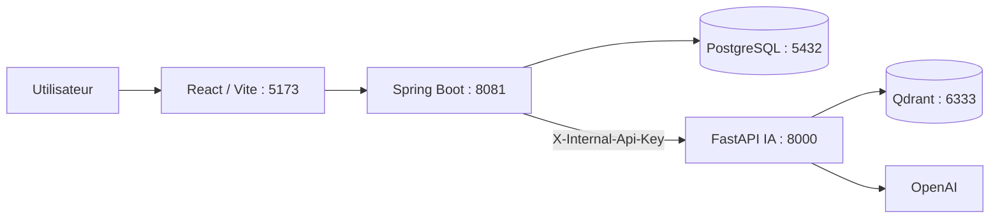

# Engineering Copilot

<p align="center">
  
</p>

<p align="center">
  <a href="https://github.com/omarfh111/engineering-copilot-ai/actions/workflows/ci.yml"></a>
  <a href="LICENSE"></a>
  
  
  
</p>

Plateforme d'assistance à l'ingénierie logicielle. Elle centralise les projets, dépôts, documents, analyses IA, revues humaines, recommandations et tâches de suivi. Le produit est organisé en monorepo : l'application métier ne publie qu'une API Spring Boot ; FastAPI reste un service IA interne.

> État de livraison : Sprint 4 en cours de validation. Voir l'[audit de finalisation](docs/FINALIZATION_AUDIT.md) avant toute fusion vers `main`.

## Architecture



React n'appelle jamais FastAPI directement. Pour une ingestion, Spring Boot reçoit et stocke le document, puis transmet une copie multipart temporaire au service IA pour l'extraction, le découpage, les embeddings et l'indexation Qdrant.

## Composants

| Dossier | Responsabilité | Technologie |
| --- | --- | --- |
| `frontend/` | Interface, tableaux de bord, gestion des projets, analyses et revues | React, TypeScript, Vite, Tailwind |
| `backend/` | API publique, sécurité, règles métier, stockage des documents | Spring Boot, Java 17, PostgreSQL |
| `ai-service/` | Ingestion, RAG, agents d'analyse, recherche vectorielle | FastAPI, Python 3.12, Qdrant |
| `infra/` | Services d'état locaux | Docker Compose, PostgreSQL, Qdrant, Mailpit |
| `docs/` | Architecture, plans de test, validation et audit de livraison | Markdown |

## Prérequis

- Node.js 22 et npm
- Java **17** ou supérieur (la configuration Maven cible Java 17)
- Python 3.12
- Docker Desktop pour PostgreSQL, Qdrant et Mailpit
- Une clé OpenAI uniquement pour les parcours IA qui appellent le fournisseur

## Démarrage local

1. Créer les variables locales sans les versionner :

   ```powershell
   Copy-Item backend/.env.example backend/.env
   Copy-Item ai-service/.env.example ai-service/.env
   Copy-Item frontend/.env.example frontend/.env
   ```

2. Définir la même valeur forte de `AI_INTERNAL_API_KEY` dans `backend/.env` et `ai-service/.env`. Renseigner les paramètres PostgreSQL, CORS et, si nécessaire, `OPENAI_API_KEY`.

3. Démarrer les services d'infrastructure :

   ```powershell
   docker compose -f infra/docker-compose.yml up -d
   ```

4. Dans trois terminaux séparés, démarrer les services applicatifs dans cet ordre :

   ```powershell
   cd ai-service; python -m pip install -r requirements.txt; python -m uvicorn app.main:app --reload --port 8000
   cd backend; .\mvnw.cmd spring-boot:run
   cd frontend; npm ci; npm run dev
   ```

Les services sont disponibles sur React `5173`, Spring Boot `8081`, FastAPI `8000`, PostgreSQL `5432`, Qdrant `6333` et Mailpit `8025`.

## Vérification

```powershell
cd frontend; npm run build
cd ..\ai-service; python -m pytest -q
cd ..\backend; .\mvnw.cmd -Dtest=AuditLogServiceImplTest test
```

Les tests d'intégration IA et ceux appelant des fournisseurs externes sont marqués `integration` et exclus par défaut. Pour les demander explicitement :

```powershell
$env:RUN_LIVE_INTEGRATION_TESTS = "1"
python -m pytest tests -m integration -q
```

La CI GitHub exécute ces contrôles à chaque push sur `main`, `sprint4`, `Sprint2` et `Sprint3`, ainsi que sur chaque pull request vers `main`. Elle ne déploie jamais automatiquement.

## Documentation

- [Audit de finalisation Sprint 4](docs/FINALIZATION_AUDIT.md)
- [Validation Sprint 2](docs/SPRINT2_ACCEPTANCE.md)
- [Architecture des agents Sprint 3](docs/SPRINT3_AGENT_ARCHITECTURE.md)
- [Plan de test Sprint 3](docs/SPRINT3_TEST_PLAN.md)
- [Contrat Spring Boot — IA](backend/docs/ROUTAGE_SAE_IA.md)
- [Architecture backend](backend/docs/ARCHITECTURE.md)
- [Guide du service IA](ai-service/README.md)

## Git et livraison

Les branches distantes actuelles sont `main`, `Sprint2`, `Sprint3`, `sae` et `sprint4`. La branche de consolidation est `sprint4`. La fusion vers `main` n'est autorisée qu'après CI verte et résolution des conditions de l'audit.

```powershell
git fetch origin --prune
git branch -r
git checkout sprint4
git push origin sprint4
```

Pour la procédure de fusion approuvée, suivre exactement la section « Après les corrections » de l'[audit de finalisation](docs/FINALIZATION_AUDIT.md).

## Sécurité

- Ne jamais versionner `.env`, clés API, mots de passe ou documents utilisateurs réels.
- Garder `AI_INTERNAL_API_KEY` identique uniquement entre backend et service IA ; elle ne doit jamais être exposée au navigateur.
- Configurer `APP_CORS_ALLOWED_ORIGINS` avec les origines exactes du frontend.
- Les propositions IA et les écritures métier sont soumises à une revue humaine.

## Licence

Ce dépôt est distribué sous licence [MIT](LICENSE).
