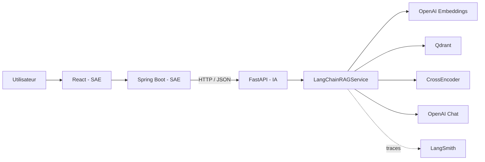

# Engineering Copilot AI

Microservice IA de la plateforme **Engineering Copilot**. Il transforme un corpus de documentation technique en réponses sourcées grâce à une chaîne RAG (Retrieval-Augmented Generation) exposée par FastAPI.

> État du projet : **Sprint 2 - développement du socle**. La chaîne RAG et son API sont utilisables. L'ingestion dynamique de documents, l'orchestration multi-agents et le déploiement Docker restent à réaliser.

## Répartition IA / SAE

Le projet est développé par deux personnes avec une frontière claire entre les deux parties :

| Partie IA - ce dépôt | Partie SAE - application principale |
| --- | --- |
| FastAPI et contrat d'API IA | Frontend React |
| Embeddings et recherche sémantique | Backend Spring Boot |
| Qdrant et pipeline RAG | PostgreSQL et données métier |
| Reranking et génération de réponses | Authentification et autorisations |
| Orchestrateur et agents à venir | Utilisateurs, projets, repositories et documents |
| Évaluation de la qualité IA | Dashboard, intégration et déploiement |

Le chemin d'intégration recommandé est :

```text
React -> Spring Boot SAE -> FastAPI IA -> Qdrant / OpenAI
```

React ne doit pas appeler directement FastAPI en production. Spring Boot garde la responsabilité de l'authentification, des droits, des identifiants projet et de l'API publique.

## Architecture actuelle



Pipeline validé :

```text
Question
  -> text-embedding-3-small
  -> recherche Qdrant Top 10
  -> reranking CrossEncoder
  -> Top 5 chunks
  -> génération gpt-4o-mini
  -> réponse + fichiers sources + pages
```

## État fonctionnel au Sprint 2

### Disponible

- extraction, découpage et nettoyage expérimental de 19 documents ;
- corpus équilibré de 800 chunks avec `source` et `page_number` ;
- comparaison de cinq modèles d'embedding ;
- indexation et recherche vectorielle Qdrant ;
- reranking CrossEncoder ou LLM ;
- génération RAG avec LangChain et traces LangSmith ;
- endpoints FastAPI de santé, question/réponse et retrieval ;
- réponses contenant les sources et numéros de page.

### Pas encore implémenté

- upload et ingestion dynamique depuis Spring Boot ;
- routes métier `documents`, `projects`, `audit`, `analysis`, `todo` et `auth` ;
- orchestrateur et agents spécialisés ;
- analyse automatique de repositories GitHub/GitLab ;
- authentification service-à-service ;
- image Docker et composition complète des services ;
- tests automatisés isolés des services cloud.

Les fichiers correspondants existent parfois comme squelettes vides. Ils ne constituent pas encore une API disponible.

## Baseline IA retenue

| Composant | Choix actuel |
| --- | --- |
| Embedding principal | `text-embedding-3-small` (1536 dimensions) |
| Alternative locale évaluée | `sentence-transformers/all-MiniLM-L6-v2` |
| Base vectorielle | Qdrant, distance cosinus |
| Retrieval | Top 10 |
| Reranker par défaut | `cross-encoder/ms-marco-MiniLM-L-6-v2` |
| Contexte final | Top 5 chunks |
| LLM de génération | `gpt-4o-mini` |
| Orchestration | LangChain |
| Observabilité | LangSmith |
| API | FastAPI |

Sur les 64 questions du jeu d'évaluation, OpenAI a obtenu un MRR de `0.7942` avant reranking et `0.8091` après reranking. Les résultats complets sont dans [experiments/results/comparison_report.md](experiments/results/comparison_report.md).

## Travaux réalisés et évaluations

### Préparation du corpus

| Étape | Entrée | Résultat |
| --- | ---: | ---: |
| collecte documentaire | 19 documents, environ 2967 pages | 4 catégories métier |
| première itération de chunking | 19 documents | 5604 chunks |
| premier nettoyage | 5604 chunks | 4831 conservés, environ 773 supprimés |
| re-chunking page par page | 19 documents | 7156 chunks dans l'artefact actuel |
| nettoyage page-aware | 7156 chunks | 5821 conservés dans l'artefact actuel |
| ajout des métadonnées | chunks par page | `source`, `page_number`, `chunk_id` et catégorie |
| échantillonnage équilibré | 5821 chunks | 800 chunks, 200 par catégorie |
| golden dataset | 19 documents | 64 questions annotées |

Le golden dataset contient 28 questions factuelles, 16 questions cross-document, 10 questions multi-hop et 10 questions négatives.

Les valeurs `5604/4831` décrivent la première campagne rapportée. Les fichiers JSONL versionnés ont ensuite été régénérés page par page et contiennent actuellement `7156/5821` enregistrements.

### Benchmark des embeddings sur 80 chunks

| Modèle | Provider | Dimension | Temps total | Temps/chunk |
| --- | --- | ---: | ---: | ---: |
| `qwen3-embedding:8b` | Ollama | 4096 | 50.534 s | 0.6317 s |
| `text-embedding-3-small` | OpenAI | 1536 | 5.897 s | 0.0737 s |
| `all-MiniLM-L6-v2` | SentenceTransformers | 384 | 1.863 s | 0.0233 s |
| `BAAI/bge-m3` | SentenceTransformers | 1024 | 46.950 s | 0.5869 s |
| `nomic-embed-text-v1.5` | SentenceTransformers | 768 | 18.786 s | 0.2348 s |

MiniLM est le plus rapide et le plus léger. OpenAI a été retenu comme modèle principal grâce à son compromis entre qualité de retrieval, temps et simplicité d'intégration. MiniLM reste l'alternative locale.

### Retrieval sur 200 chunks - Top 5

| Modèle | Hit@5 fichier | Precision@5 | Recall@5 | MRR | Temps moyen |
| --- | ---: | ---: | ---: | ---: | ---: |
| Qwen3 | 0.8438 | 0.6281 | 0.7995 | 0.7628 | 2.6794 s |
| OpenAI | 0.8438 | 0.6344 | 0.8177 | 0.7526 | 1.2317 s |
| MiniLM | 0.8281 | 0.5906 | 0.7734 | 0.7492 | 3.3290 s |
| BGE-M3 | 0.7812 | 0.5500 | 0.7292 | 0.6943 | 6.2663 s |
| Nomic | 0.6719 | 0.4344 | 0.6016 | 0.5547 | 6.3285 s |

### Retrieval sur 800 chunks - Top 5

| Modèle | Hit@5 fichier | Precision@5 | Recall@5 | MRR | Temps moyen |
| --- | ---: | ---: | ---: | ---: | ---: |
| OpenAI | 0.9219 | 0.7562 | 0.9036 | 0.8385 | 1.1670 s |
| MiniLM | 0.8906 | 0.7000 | 0.8750 | 0.8203 | 3.3034 s |
| Qwen3 | 0.8906 | 0.7219 | 0.8724 | 0.8065 | 2.6933 s |
| BGE-M3 | 0.8125 | 0.6531 | 0.7969 | 0.7708 | 6.1310 s |
| Nomic | 0.7188 | 0.5625 | 0.6849 | 0.6523 | 6.4037 s |

### Évaluation finale après chunking par page

Le passage à un chunking page par page a modifié les résultats, mais permet désormais des citations fiables.

| Configuration | Hit fichier | Précision | Recall | MRR | Hit catégorie | Temps moyen |
| --- | ---: | ---: | ---: | ---: | ---: | ---: |
| OpenAI Top 10 | 0.8906 | 0.6703 | 0.8724 | 0.7942 | 0.9688 | 0.8125 s |
| MiniLM Top 10 | 0.9062 | 0.6281 | 0.8880 | 0.7465 | 0.9531 | 4.9525 s |
| OpenAI + CrossEncoder Top 5 | 0.8750 | 0.7063 | 0.8490 | 0.8091 | 0.9375 | 0.8125 s |
| MiniLM + CrossEncoder Top 5 | 0.8594 | 0.6719 | 0.8359 | 0.7786 | 0.9219 | 4.9525 s |

Le reranking améliore la précision et le classement des premières réponses : pour OpenAI, la précision passe de `0.6703` à `0.7063` et le MRR de `0.7942` à `0.8091`.

### Indexation Qdrant finale

| Collection | Modèle | Dimension | Points | Temps total | Statut |
| --- | --- | ---: | ---: | ---: | --- |
| `exp_openai_text_embedding_3_small` | OpenAI | 1536 | 800 | 58.371 s | succès |
| `exp_minilm_l6_v2` | MiniLM | 384 | 800 | 50.875 s | succès |

### Tests applicatifs réalisés

| Composant | Vérification |
| --- | --- |
| configuration | chargement Pydantic de `.env` |
| PostgreSQL | création de l'engine et de la session SQLAlchemy |
| embeddings | dimensions OpenAI 1536 et MiniLM 384 |
| Qdrant | création de collection, upsert, recherche, compteur de points |
| CrossEncoder | Top 10 retrieval vers Top 5 reranké |
| LLM reranker | sélection Top 5 par `gpt-4o-mini` |
| RAG SDK | réponse finale et sources avec OpenAI SDK |
| RAG LangChain | chaîne, réponse française, sources et modes de reranking |
| LangSmith | traces des étapes retrieval, contexte et génération |
| FastAPI | OpenAPI, santé, validation et quatre routes RAG |

La méthodologie complète, les commandes, les métriques et les limites sont documentées dans [docs/EXPERIMENTATIONS_ET_EVALUATIONS.md](docs/EXPERIMENTATIONS_ET_EVALUATIONS.md).

## Documentation du projet

| Document | Contenu |
| --- | --- |
| [Guide de la codebase](docs/GUIDE_CODEBASE.md) | rôle de chaque fichier, statut, flux d'exécution et dépendances |
| [Expérimentations et évaluations](docs/EXPERIMENTATIONS_ET_EVALUATIONS.md) | corpus, benchmarks, métriques, tests, résultats et reproduction |
| [Routage SAE / IA](docs/ROUTAGE_SAE_IA.md) | endpoints, DTO Spring Boot, erreurs, sécurité et handoff |
| [Rapport comparatif généré](experiments/results/comparison_report.md) | synthèse automatique des résultats enregistrés |

## Démarrage local

### Prérequis

- Python 3.11 ou 3.12 ;
- une collection Qdrant compatible avec des vecteurs de dimension 1536 ;
- une clé OpenAI ;
- Git.

PostgreSQL n'est pas utilisé par les routes RAG actuelles. Il reste dans la configuration en préparation de l'intégration globale.

### Installation

```powershell
python -m venv venv
.\venv\Scripts\Activate.ps1
python -m pip install --upgrade pip
python -m pip install -r requirements.txt
Copy-Item .env.example .env
```

Renseigner au minimum `OPENAI_API_KEY`, `QDRANT_URL`, `QDRANT_API_KEY` et les noms de collection dans `.env`. Ne jamais committer ce fichier.

### Lancement

```powershell
python -m uvicorn app.main:app --reload --host 0.0.0.0 --port 8000
```

Interfaces utiles :

- API : `http://localhost:8000`
- Swagger UI : `http://localhost:8000/docs`
- OpenAPI : `http://localhost:8000/openapi.json`
- santé applicative : `http://localhost:8000/health`
- santé RAG/Qdrant : `http://localhost:8000/api/v1/rag/health`

Le premier appel utilisant le CrossEncoder peut être lent, car le modèle est chargé en mémoire à la demande.

## Appel rapide

```powershell
$body = @{ question = "Quelles sont les bonnes pratiques de Spring Boot ?" } |
    ConvertTo-Json

Invoke-RestMethod `
    -Method Post `
    -Uri "http://localhost:8000/api/v1/rag/ask-simple" `
    -ContentType "application/json" `
    -Body $body
```

Réponse simplifiée :

```json
{
  "question": "Quelles sont les bonnes pratiques de Spring Boot ?",
  "answer": "...",
  "sources": [
    {
      "source": "framework_docs/spring-boot-reference.pdf",
      "page_number": 202,
      "score": 0.72,
      "embedding_score": 0.72,
      "rerank_score": 1.84,
      "chunk_id": "spring-boot-reference_p202_0"
    }
  ],
  "chunks_used": 5,
  "collection_name": "exp_openai_text_embedding_3_small",
  "retrieval_top_k": 10,
  "final_top_k": 5,
  "reranker_type": "cross_encoder",
  "framework": "langchain"
}
```

## Routes exposées

| Méthode | Route | Usage |
| --- | --- | --- |
| `GET` | `/` | présence du service |
| `GET` | `/health` | liveness FastAPI, sans test des dépendances |
| `GET` | `/api/v1/rag/health` | disponibilité de la collection Qdrant |
| `POST` | `/api/v1/rag/ask-simple` | route recommandée pour Spring Boot |
| `POST` | `/api/v1/rag/ask` | route avancée avec collection, catégorie et reranker |
| `POST` | `/api/v1/rag/retrieve` | chunks récupérés sans génération finale |

Le contrat détaillé, les DTO Spring Boot et les règles d'intégration sont décrits dans [docs/ROUTAGE_SAE_IA.md](docs/ROUTAGE_SAE_IA.md).

## Structure utile du dépôt

```text
app/
├── api/v1/rag.py                  # Contrats et routes RAG
├── api/dependencies.py            # Cache des services lourds
├── core/config.py                 # Lecture de .env
├── main.py                        # Application FastAPI et CORS
└── services/
    ├── embedding_service.py       # OpenAI ou SentenceTransformers
    ├── qdrant_service.py          # Collections, indexation et recherche
    ├── reranker_service.py        # CrossEncoder local
    ├── llm_reranker_service.py    # Reranking optionnel par LLM
    └── langchain_rag_service.py   # Chaîne RAG de production actuelle

experiments/
├── data/                          # Corpus, chunks et golden dataset
├── scripts/                       # Préparation et évaluation
└── results/                       # Métriques et rapport comparatif

tests/                             # Tests historiques, plusieurs sont intégrés aux clouds
docs/ROUTAGE_SAE_IA.md             # Handoff pour la partie SAE
docs/GUIDE_CODEBASE.md              # Inventaire et explication des fichiers
docs/EXPERIMENTATIONS_ET_EVALUATIONS.md # Protocole et résultats IA
```

## Tests et vérifications

Vérification locale sans appel cloud :

```powershell
$env:PYTHONUTF8 = "1"
python -m compileall app
python -m tests.test_config
python -m tests.test_logger
```

Attention : plusieurs tests existants appellent OpenAI et Qdrant. Certains recréent une collection de test. Utiliser uniquement un projet Qdrant isolé avant de lancer toute la suite :

```powershell
python -m pytest -q
```

## Planning des quatre sprints

| Sprint | Objectif | État IA |
| --- | --- | --- |
| 1 | Analyse et conception | étude RAG/Qdrant et définition des agents réalisées |
| 2 | Développement du socle | pipeline, benchmark, Qdrant, RAG et API en cours/validés |
| 3 | Développement IA | orchestrateur et agents à implémenter |
| 4 | Intégration et validation | optimisation, évaluation, sécurité et déploiement |

## Points techniques à traiter ensuite

- déplacer la collection, les modèles et les valeurs Top K vers une configuration réellement utilisée ;
- appliquer le filtre Qdrant avant la limite Top K plutôt qu'après la recherche ;
- ajouter une route d'ingestion idempotente et le suivi de son statut ;
- définir une authentification interne entre Spring Boot et FastAPI ;
- normaliser les erreurs et ajouter un identifiant de corrélation ;
- isoler les tests unitaires des tests d'intégration cloud ;
- nettoyer les doublons dans `requirements.txt` et figer les versions ;
- compléter Docker, la readiness et les limites de taille/temps.

## Sécurité

- `.env` est ignoré par Git et ne doit jamais être partagé ;
- les clés OpenAI, Qdrant, GitHub, Hugging Face et LangSmith déjà exposées doivent être révoquées puis régénérées ;
- FastAPI ne possède actuellement aucune authentification : ne pas l'exposer directement sur Internet ;
- Spring Boot doit rester la frontière d'authentification utilisateur.

## Licence

Ce projet est distribué sous licence MIT. Voir [LICENSE](LICENSE).
