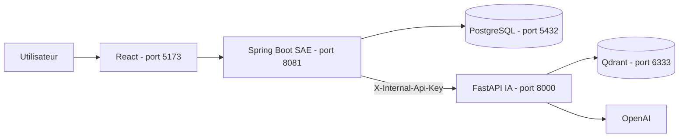

# Engineering Copilot

Plateforme en cours de développement pour l'analyse, l'audit et la documentation de projets logiciels. Le dépôt rassemble les deux périmètres du binôme : le socle applicatif **SAE** et le microservice **IA**.

> Statut : Sprint 2 consolidé. Les fonctions IA multi-agents, l'audit automatique et la QA avancée appartiennent au Sprint 3 et restent marquées **en cours**.

## Architecture



Spring Boot est la seule API publique. React ne contacte jamais FastAPI. Pour un fichier envoyé lors de la création d'un document, React envoie le fichier à Spring, Spring le conserve puis transmet une copie multipart temporaire à FastAPI pour l'extraction, le chunking, les embeddings et l'indexation Qdrant.

## Organisation

```text
engineering-copilot-ai/
├── frontend/                     # React + Vite
├── backend/                      # Spring Boot + PostgreSQL métier
├── ai-service/                   # FastAPI, RAG, embeddings, Qdrant
├── infra/                        # Docker Compose et infrastructure locale
├── docs/                         # Architecture, acceptation et Sprint 3
├── START_HERE.md                 # Démarrage rapide historique
└── README.md                     # Ce point d'entrée
```

## Démarrage local

1. Copier `backend/.env.example` vers `backend/.env`.
2. Copier `ai-service/.env.example` vers `ai-service/.env`.
3. Définir la même valeur longue pour `AI_INTERNAL_API_KEY` dans les deux fichiers, puis renseigner `OPENAI_API_KEY` et Qdrant si nécessaire.
4. Lancer PostgreSQL et Qdrant : `docker compose -f infra/docker-compose.yml up -d` depuis la racine.
5. Lancer FastAPI, puis Spring Boot, puis React. Les détails sont dans les README des sous-projets.

Ne versionnez jamais les deux fichiers `.env`, les mots de passe ou les clés API.

## Documentation

- [Validation Sprint 2](docs/SPRINT2_ACCEPTANCE.md)
- [Backlog QA et Sprint 3](docs/SPRINT3_QA_BACKLOG.md)
- [Contrat backend - IA](backend/docs/ROUTAGE_SAE_IA.md)
- [Expérimentations et évaluations IA](ai-service/docs/EXPERIMENTATIONS_ET_EVALUATIONS.md)
- [Guide IA existant](ai-service/docs/GUIDE_CODEBASE.md)

## Répartition Sprint 2

| Périmètre SAE | Périmètre IA |
| --- | --- |
| Authentification, utilisateurs, projets, repositories, documents | Ingestion, embeddings, indexation Qdrant |
| React, Spring Boot, PostgreSQL, API REST | FastAPI, RAG et évaluations de retrieval |

Les livrables du Sprint 3 sont conservés dans le code lorsqu'ils existent, mais ils ne sont pas annoncés comme terminés.
