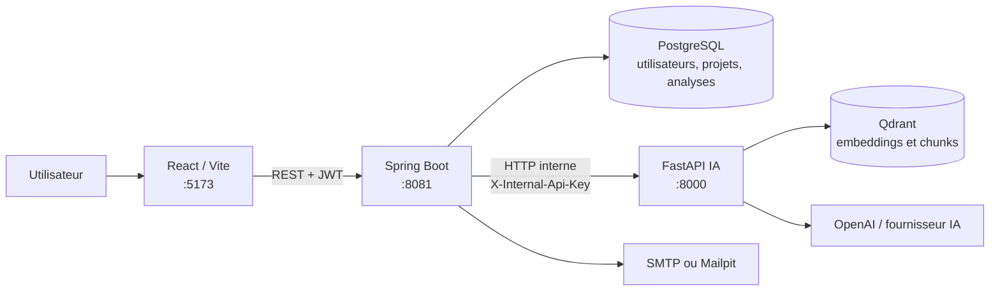
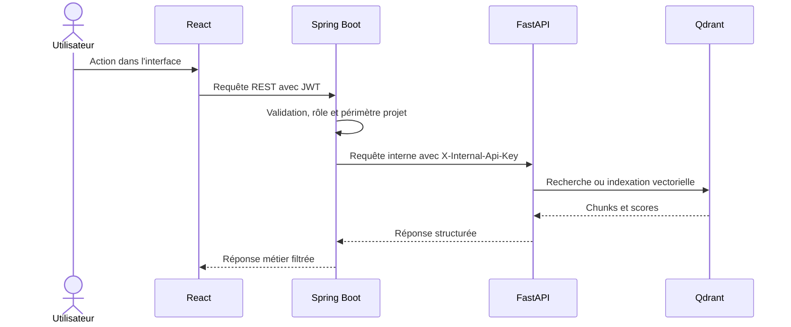
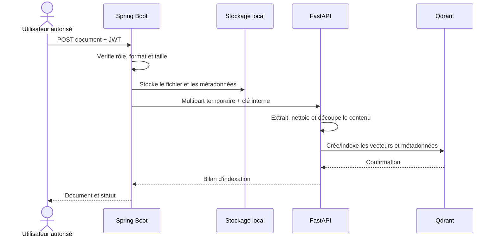
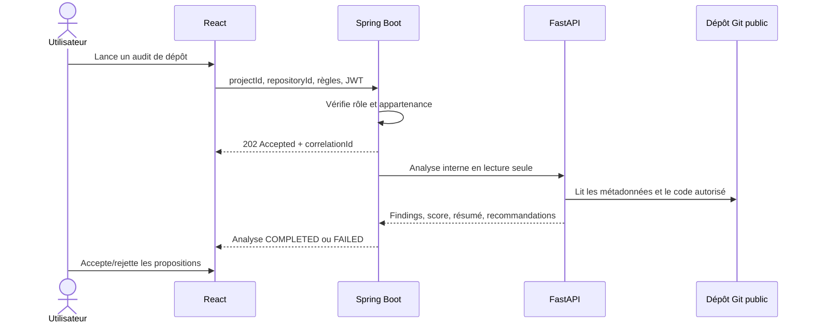
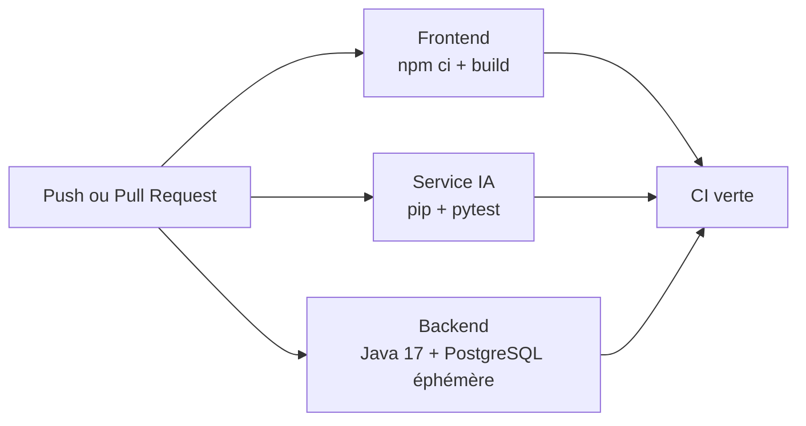

# Engineering Copilot

<p align="center">
  
</p>

<p align="center">
  <a href="https://github.com/omarfh111/engineering-copilot-ai/actions/workflows/ci.yml"></a>
  <a href="LICENSE"></a>
  
  
  
  
</p>

Engineering Copilot est une plateforme d'assistance à l'ingénierie logicielle. Elle aide les équipes à centraliser projets, dépôts, documents, audits IA, constats, revues humaines, recommandations et tâches de suivi. Le produit est un monorepo : React fournit l'expérience utilisateur, Spring Boot expose l'API métier sécurisée et FastAPI porte les capacités d'analyse et de RAG.

> **Statut Sprint 4 :** validation technique réussie. Les trois jobs CI, la chaîne backend/PostgreSQL et la sonde RAG/Qdrant sont vérifiés. L'audit de livraison et les limites connues sont dans [docs/FINALIZATION_AUDIT.md](docs/FINALIZATION_AUDIT.md).

## Sommaire

- [Vue d'ensemble](#vue-densemble)
- [Architecture et frontières de sécurité](#architecture-et-frontières-de-sécurité)
- [Fonctionnalités et rôles](#fonctionnalités-et-rôles)
- [Structure du dépôt](#structure-du-dépôt)
- [Technologies](#technologies)
- [Démarrage local](#démarrage-local)
- [Contrats API et flux de données](#contrats-api-et-flux-de-données)
- [RAG, évaluations et métriques](#rag-évaluations-et-métriques)
- [Tests, CI et contrôles de livraison](#tests-ci-et-contrôles-de-livraison)
- [Incidents rencontrés et résolutions](#incidents-rencontrés-et-résolutions)
- [Sécurité, limites et prochaines étapes](#sécurité-limites-et-prochaines-étapes)
- [Documentation et Git](#documentation-et-git)

## Vue d'ensemble

| Domaine | Ce qui est fourni | État vérifié |
| --- | --- | --- |
| Interface | Tableaux de bord, projets, dépôts, documents, analyses, revues et assistant | Build Vite et HTTP 200 validés |
| API métier | JWT, RBAC, persistance, audit, stockage documentaire et passerelle IA | Spring Boot et PostgreSQL validés |
| IA | Extraction, chunking, embeddings, Qdrant, retrieval, reranking et agents | FastAPI et readiness RAG validées |
| Qualité | Tests frontend, Python et Java ; CI GitHub automatisée | Trois jobs CI verts |
| Livraison | README, diagrammes, guide d'exploitation et audit final | Documentation mise à jour |

### Principes de conception

- Le navigateur ne communique jamais directement avec FastAPI ou Qdrant.
- Spring Boot est l'unique API publique : il authentifie l'utilisateur et applique les droits.
- FastAPI est un microservice interne protégé par une clé partagée et distincte du JWT utilisateur.
- Les résultats IA sont des propositions. Une revue humaine est nécessaire avant une écriture métier, une tâche ou une publication de connaissance.
- Les fichiers uploadés et les secrets sont des données d'exécution : ils ne sont pas versionnés avec le code.

## Architecture et frontières de sécurité



### Responsabilités par couche

| Couche | Responsabilités | Données auxquelles elle accède |
| --- | --- | --- |
| `frontend/` | Interface React, navigation, formulaires, affichage des analyses et revues | API Spring Boot uniquement |
| `backend/` | Authentification, rôles, règles métier, JPA, documents, API REST publique | PostgreSQL, stockage de documents, FastAPI interne |
| `ai-service/` | Extraction de texte, chunking, embeddings, retrieval, reranking, agents spécialisés | Qdrant, fournisseur IA, dépôt distant en lecture seule |
| `infra/` | Dépendances de développement local | PostgreSQL, Qdrant, Mailpit |

### Frontières de confiance



`AI_INTERNAL_API_KEY` est identique dans `backend/.env` et `ai-service/.env`, mais n'est jamais transmise au navigateur. Les routes FastAPI protégées rejettent les requêtes sans cette clé. Le backend ne transmet jamais le JWT utilisateur au service IA.

## Fonctionnalités et rôles

### Fonctionnalités principales

| Fonctionnalité | Description | Contrôle humain |
| --- | --- | --- |
| Gestion des comptes | Inscription, connexion JWT, profil, changement de mot de passe et rôles | Administration des comptes réservée aux administrateurs |
| Projets et dépôts | Organisation des projets, dépôts et métadonnées de branche | Contrôle d'accès par rôle et projet |
| Documents | Dépôt de PDF, DOCX, TXT, Markdown ou HTML, stockage et indexation IA | Taille maximale 10 Mo ; validation backend |
| Assistant RAG | Réponse sourcée à partir du corpus indexé | Réservé aux rôles autorisés, réponse à relire |
| Audit de dépôt | Analyse asynchrone de dépôt GitHub public et constats structurés | Aucune écriture automatique dans les tâches |
| Revues et TODO | Acceptation/refus de constats, proposition puis confirmation de tâches | Confirmation explicite obligatoire |
| Journalisation | Piste d'audit des actions importantes | Testée avec PostgreSQL |

### Rôles applicatifs

| Rôle | Capacités typiques |
| --- | --- |
| `ADMIN` | Administration utilisateurs, équipes, paramètres et supervision |
| `MANAGER` | Gestion de projets, dépôts, analyses et suivi |
| `ARCHITECT` | Consultation architecture, analyses et recommandations |
| `QA` | Consultation, validation de constats et publication de connaissance autorisée |
| `DEVELOPER` | Assistant IA, consultation des analyses et actions associées au projet |
| `AUDITOR` | Consultation des éléments d'audit selon le périmètre attribué |

Les autorisations exactes sont implémentées dans `backend/src/main/java/org/example/copilote/security/SecurityConfig.java`.

## Structure du dépôt

```text
engineering-copilot-ai/
├── frontend/                 # React, TypeScript, Vite, Tailwind
│   ├── src/pages/            # Pages métier et tableaux de bord
│   ├── src/services/         # Appels REST vers Spring Boot
│   └── .env.example          # VITE_API_BASE_URL
├── backend/                  # Spring Boot Java 17
│   ├── src/main/java/        # Controllers, services, sécurité, JPA
│   ├── src/test/java/        # Tests unitaires et smoke tests PostgreSQL
│   ├── docs/                 # Architecture backend et contrat IA
│   └── .env.example          # Configuration locale sans secret réel
├── ai-service/               # FastAPI et pipeline RAG
│   ├── app/api/v1/           # Routes RAG, documents et analyses
│   ├── app/services/         # Qdrant, embeddings, reranking, RAG
│   ├── app/agents/           # Agents de fondation et d'analyse
│   ├── tests/                # Tests déterministes et intégrations marquées
│   ├── docs/                 # Méthodologie, routage et expérimentations
│   └── experiments/results/  # Résultats d'évaluation reproductibles
├── infra/                    # Compose PostgreSQL, Qdrant et Mailpit
├── docs/                     # Guides transverses, audits et plans de test
├── assets/                   # Logo du projet
├── .github/workflows/ci.yml  # CI GitHub Actions
├── Jenkinsfile               # Pipeline Jenkins sans déploiement automatique
└── START_HERE.md             # Démarrage rapide
```

## Technologies

| Domaine | Technologies |
| --- | --- |
| Frontend | React 18, TypeScript, Vite 5, Tailwind CSS, React Router, Axios |
| Backend | Java 17, Spring Boot 4, Spring Security, JWT, Spring Data JPA, Maven |
| Données métier | PostgreSQL, Hibernate/JPA |
| IA | Python 3.12, FastAPI, Pydantic Settings, LangChain, OpenAI SDK |
| Recherche | Qdrant, `text-embedding-3-small`, MiniLM, CrossEncoder |
| Documents | PyPDF, PyMuPDF, python-docx, BeautifulSoup, Markdown |
| Qualité | JUnit, Mockito, Pytest, TypeScript, GitHub Actions, Jenkins |

## Démarrage local

### Prérequis

- Node.js 22 et npm ;
- Java 17 ou supérieur ;
- Python 3.12 ;
- PostgreSQL 16 recommandé ;
- Qdrant local via Docker Compose **ou** Qdrant Cloud configuré dans `ai-service/.env` ;
- Docker Desktop ou un moteur Compose compatible pour le mode local complet ;
- une clé OpenAI uniquement si les fonctions qui appellent le fournisseur sont utilisées.

Sous Windows, vérifier que Maven utilise Java 17 :

```powershell
java -version
cd backend
.\mvnw.cmd -version
```

Si le Java système est plus ancien, exécuter Maven avec le JDK 17 configuré :

```powershell
cmd /d /c 'set "JAVA_HOME=C:\chemin\vers\jdk-17" & mvnw.cmd test'
```

### Configuration locale

Créer les fichiers locaux, qui sont exclus de Git :

```powershell
Copy-Item backend/.env.example backend/.env
Copy-Item ai-service/.env.example ai-service/.env
Copy-Item frontend/.env.example frontend/.env
```

Variables essentielles :

| Fichier | Variables à renseigner | Remarques |
| --- | --- | --- |
| `backend/.env` | `SPRING_DATASOURCE_*`, `AI_SERVICE_BASE_URL`, `AI_INTERNAL_API_KEY` | Le secret IA doit correspondre au service FastAPI. |
| `ai-service/.env` | `QDRANT_URL`, `QDRANT_API_KEY`, `OPENAI_API_KEY`, `AI_INTERNAL_API_KEY` | La clé OpenAI est nécessaire seulement aux parcours qui l'appellent. |
| `frontend/.env` | `VITE_API_BASE_URL` | Par défaut : `http://localhost:8081`. |

Ne pas mettre de valeur réelle dans un fichier `.env.example`, dans la documentation, dans les captures d'écran ou dans Git.

### Mode A — infrastructure locale Compose

```powershell
docker compose -f infra/docker-compose.yml up -d
```

Ce mode démarre PostgreSQL (`5432`), Qdrant (`6333`) et Mailpit (`1025` SMTP, `8025` interface web). Les données persistent dans des volumes Docker.

### Mode B — Qdrant Cloud

Renseigner `QDRANT_URL` et `QDRANT_API_KEY` dans `ai-service/.env`. PostgreSQL reste nécessaire pour le backend. Dans ce mode, le port local `6333` n'est pas attendu ; la readiness RAG protégée est la vérification pertinente.

### Lancement des applications

Démarrer les applications dans trois terminaux distincts, dans cet ordre :

```powershell
cd ai-service
python -m pip install -r requirements.txt
python -m uvicorn app.main:app --reload --host 127.0.0.1 --port 8000
```

```powershell
cd backend
.\mvnw.cmd spring-boot:run
```

```powershell
cd frontend
npm ci
npm run dev
```

| Service | URL locale | Vérification |
| --- | --- | --- |
| Frontend | `http://127.0.0.1:5173` | Page HTTP 200 |
| Backend | `http://127.0.0.1:8081` | Authentification puis API REST |
| FastAPI | `http://127.0.0.1:8000` | `/health`, `/docs`, `/openapi.json` |
| PostgreSQL | `localhost:5432` | Connexion backend ou `Test-NetConnection` |
| Qdrant local | `http://127.0.0.1:6333/dashboard` | Collections et dashboard |
| Mailpit local | `http://127.0.0.1:8025` | E-mails de développement |

`GET /api/health` côté Spring Boot est protégé par JWT : un `401` sans jeton est normal et démontre que la règle de sécurité est active.

## Contrats API et flux de données

### Routes de liaison Spring Boot — FastAPI

| API publique Spring Boot | Rôle | Appel interne FastAPI |
| --- | --- | --- |
| `POST /api/assistant/ask` | Pose une question RAG | `POST /api/v1/rag/ask-simple` |
| `GET /api/assistant/health` | Vérifie la disponibilité IA | `GET /api/v1/rag/health` |
| `POST /api/documents/upload` | Enregistre et indexe un fichier | `POST /api/v1/documents/ingest` |
| `POST /api/analyses/run` | Lance un audit asynchrone | `POST /api/v1/analyses/run` |

Les routes FastAPI `/api/v1/rag/**`, `/api/v1/documents/**` et `/api/v1/analyses/**` sont internes. Elles nécessitent l'en-tête `X-Internal-Api-Key` et ne doivent pas être exposées dans le frontend.

### Dépôt et indexation d'un document



Formats supportés : PDF, DOCX, TXT, MD, HTML/HTM. La limite par défaut est 10 Mo côté Spring et FastAPI. Les documents déposés sont dans `storage/documents/` localement, mais ce répertoire est ignoré par Git afin de ne pas diffuser de données utilisateur.

### Analyse de dépôt multi-agents



Les agents ne créent aucune tâche automatiquement. Une revue acceptée est obligatoire avant une proposition TODO ou une publication de connaissance.

## RAG, évaluations et métriques

### Pipeline RAG retenu

```text
Question
  -> embedding text-embedding-3-small
  -> recherche Qdrant Top 10
  -> reranking CrossEncoder
  -> sélection Top 5
  -> génération gpt-4o-mini
  -> réponse, fichiers sources et numéros de page
```

| Composant | Choix de référence | Alternative évaluée |
| --- | --- | --- |
| Embeddings | OpenAI `text-embedding-3-small`, 1536 dimensions | `all-MiniLM-L6-v2`, 384 dimensions |
| Base vectorielle | Qdrant, distance cosinus | Qdrant local ou Cloud |
| Retrieval | Top 10 | Filtrage par catégorie/métadonnées |
| Reranking | `cross-encoder/ms-marco-MiniLM-L-6-v2` | Reranker LLM expérimental |
| Contexte final | Top 5 chunks | Configurable |
| Génération | `gpt-4o-mini` | Fournisseur configuré |
| Traçabilité | Sources, pages et scores | LangSmith optionnel |

### Corpus et méthodologie

| Étape | Résultat |
| --- | --- |
| Collecte | 19 documents, environ 2 967 pages, quatre catégories |
| Re-chunking page par page | 7 156 chunks produits |
| Nettoyage page-aware | 5 821 chunks conservés |
| Échantillon équilibré | 800 chunks, 200 par catégorie |
| Jeu de référence | 64 questions : factuelles, cross-document, multi-hop et négatives |

Le chunking page par page permet des citations plus fiables. Chaque chunk conserve notamment `source`, `page_number`, `chunk_id`, catégorie et métadonnées de périmètre.

### Résultats de retrieval sur 64 questions

| Configuration | Hit fichier | Précision | Recall | MRR | Hit catégorie | Temps moyen |
| --- | ---: | ---: | ---: | ---: | ---: | ---: |
| OpenAI Top 10 | 0.8906 | 0.6703 | 0.8724 | 0.7942 | 0.9688 | 0.8125 s |
| MiniLM Top 10 | 0.9062 | 0.6281 | 0.8880 | 0.7465 | 0.9531 | 4.9525 s |
| OpenAI + CrossEncoder Top 5 | 0.8750 | 0.7063 | 0.8490 | 0.8091 | 0.9375 | 0.8125 s |
| MiniLM + CrossEncoder Top 5 | 0.8594 | 0.6719 | 0.8359 | 0.7786 | 0.9219 | 4.9525 s |

Le reranking OpenAI améliore la précision de `0.6703` à `0.7063` et le MRR de `0.7942` à `0.8091`. MiniLM demeure une alternative locale légère ; OpenAI a été retenu comme baseline pour le compromis qualité, temps et intégration.

### Benchmark d'embeddings sur 80 chunks

| Modèle | Dimension | Temps total | Temps par chunk |
| --- | ---: | ---: | ---: |
| `text-embedding-3-small` | 1536 | 5.897 s | 0.0737 s |
| `all-MiniLM-L6-v2` | 384 | 1.863 s | 0.0233 s |
| `qwen3-embedding:8b` | 4096 | 50.534 s | 0.6317 s |
| `BAAI/bge-m3` | 1024 | 46.950 s | 0.5869 s |
| `nomic-embed-text-v1.5` | 768 | 18.786 s | 0.2348 s |

La collection de référence OpenAI contient 800 vecteurs et a été vérifiée via la route interne de readiness RAG.

Les données brutes et la méthode de reproduction sont disponibles dans [ai-service/docs/EXPERIMENTATIONS_ET_EVALUATIONS.md](ai-service/docs/EXPERIMENTATIONS_ET_EVALUATIONS.md).

## Tests, CI et contrôles de livraison

### Commandes locales

```powershell
cd frontend
npm run build

cd ..\ai-service
python -m pytest -q

cd ..\backend
.\mvnw.cmd test
.\mvnw.cmd -DskipTests package
```

| Couche | Contrôle | Résultat de validation Sprint 4 |
| --- | --- | --- |
| Frontend | `npm run build` : TypeScript puis Vite | Réussi ; avertissement bundle principal ~834 kB minifié |
| Service IA | `python -m pytest -q` | 34 réussis, 8 ignorés, 1 désélectionné |
| Backend | `mvnw.cmd test` | 5 réussis, dont smoke tests PostgreSQL |
| Packaging backend | `mvnw.cmd -DskipTests package` | Réussi sous Java 17 |
| RAG | `GET /api/v1/rag/health` avec clé interne | HTTP 200 ; collection existante, 800 vecteurs |

Les 8 tests IA ignorés correspondent à des intégrations volontairement dépendantes de fournisseurs, réseau ou données externes. Pour les exécuter explicitement :

```powershell
cd ai-service
$env:RUN_LIVE_INTEGRATION_TESTS = "1"
python -m pytest tests -m integration -q
```

Ces tests peuvent appeler des services externes et générer des coûts : ne les lancer qu'avec les clés et l'autorisation appropriées.

### CI GitHub Actions

Le workflow `.github/workflows/ci.yml` s'exécute sur `main`, `sprint4`, `Sprint2` et `Sprint3`, ainsi que sur les pull requests vers `main`.



Le job backend démarre PostgreSQL 16 de manière éphémère, utilise `create-drop` uniquement dans la CI et exécute les tests Spring. Aucun job CI ne déploie l'application automatiquement.

## Incidents rencontrés et résolutions

| Symptôme | Cause | Correction appliquée | Prévention |
| --- | --- | --- | --- |
| Dépendances mail Maven introuvables dans l'IDE | JDK Java 8 configuré alors que le projet cible Java 17, puis certificat TLS local non reconnu | Module basculé vers Corretto 17 ; racine TLS locale ajoutée au magasin Java ; dépendances téléchargées | Vérifier `JAVA_HOME`, SDK IntelliJ et certificat d'entreprise avant import Maven |
| Tests IA en échec lors de la collecte | Diagnostics réseau et variables requises chargés comme tests ordinaires | Collecte ciblée, paramètres par défaut sûrs et marqueur `integration` | Garder les tests connectés explicitement séparés |
| RAG retournait une erreur lors d'un premier test | FastAPI lancé dans un contexte sans accès réseau vers Qdrant Cloud | Relance du processus avec accès réseau ; connexion et readiness validées | Tester la sonde protégée quand Qdrant est externe |
| Artefacts générés suivis dans Git | Fichiers `.tsbuildinfo` et documents runtime ajoutés au dépôt | Retrait de l'index et règles `.gitignore` | Versionner le code et des jeux de test explicitement sélectionnés seulement |
| Secret SMTP commité historiquement | Exemple de configuration contenait une valeur réelle | Valeur supprimée des fichiers actifs ; secret révoqué par le propriétaire | Utiliser `.env`, un coffre de secrets et une rotation immédiate |

## Sécurité, limites et prochaines étapes

### Règles de sécurité

- Ne jamais committer de clé API, app password, JWT, document utilisateur ou fichier `.env`.
- Révoquer immédiatement tout secret diffusé ; le retirer du fichier courant ne purge pas son historique Git.
- Protéger `AI_INTERNAL_API_KEY` comme un secret de service ; elle ne doit pas être livrée au frontend.
- Fixer `APP_CORS_ALLOWED_ORIGINS` aux seules origines frontend nécessaires en environnement partagé.
- Les appels IA ne doivent pas créer seuls de TODO ou de données métier : la validation humaine est obligatoire.
- Conserver les documents utilisateurs dans le stockage d'exécution ou un stockage objet, jamais dans le dépôt source.

### Limites connues

- Le bundle JavaScript principal (~834 kB minifié) dépasse le seuil d'avertissement Vite ; le fractionnement des routes est une optimisation recommandée.
- Le tableau de santé frontend contient encore des éléments de télémétrie de démonstration. Il ne remplace pas Actuator, des métriques réelles, des SLO ni un système d'alerte de production.
- Les tests d'intégration IA avec fournisseur sont exclus de la CI pour préserver déterminisme et coûts. Ils doivent être exécutés dans un environnement dédié avec secrets.
- Les migrations de schéma versionnées restent une amélioration recommandée pour un déploiement de production reproductible.

### Feuille de route suggérée

1. Ajouter Flyway ou Liquibase pour versionner les migrations PostgreSQL.
2. Introduire Spring Boot Actuator, métriques Prometheus et alertes réelles.
3. Réduire le bundle frontend via lazy loading et `manualChunks`.
4. Ajouter une intégration OAuth2 ou un fournisseur SMTP transactionnel au lieu d'app passwords personnelles.
5. Exécuter les intégrations RAG dans un environnement éphémère avec budget et coffre de secrets.

## Documentation et Git

| Document | Contenu |
| --- | --- |
| [Démarrage rapide](START_HERE.md) | Étapes essentielles de lancement |
| [Guide technique et d'exploitation](docs/TECHNICAL_GUIDE.md) | Architecture détaillée, exploitation, métriques et incidents |
| [Audit de finalisation Sprint 4](docs/FINALIZATION_AUDIT.md) | Critères de livraison et verdict |
| [Architecture backend](backend/docs/ARCHITECTURE.md) | Organisation Spring Boot |
| [Contrat Spring Boot — IA](backend/docs/ROUTAGE_SAE_IA.md) | Routes, DTO, sécurité et handoff |
| [Architecture agents Sprint 3](docs/SPRINT3_AGENT_ARCHITECTURE.md) | Agents et orchestration |
| [Évaluations IA](ai-service/docs/EXPERIMENTATIONS_ET_EVALUATIONS.md) | Corpus, benchmarks et résultats RAG |

Branches distantes de travail : `main`, `Sprint2`, `Sprint3`, `sae` et `sprint4`. La consolidation est réalisée sur `sprint4` avant la fusion contrôlée vers `main`.

```powershell
git fetch origin --prune
git branch -r
git checkout sprint4
git pull origin sprint4
```

Après revue et CI verte, la fusion est faite exclusivement avec Git :

```powershell
git checkout main
git pull origin main
git merge --no-ff sprint4
git push origin main
```

## Licence

Ce projet est distribué sous licence [MIT](LICENSE).
