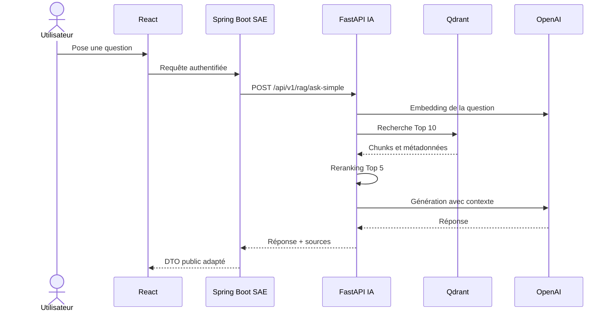

# Routage et intégration SAE / IA

Ce document est le contrat de handoff entre le backend **Spring Boot SAE** et le microservice **FastAPI IA** pendant le Sprint 2. Il décrit uniquement les routes réellement montées par `app/main.py`.

Documents complémentaires : [README principal](../README.md), [guide de la codebase](GUIDE_CODEBASE.md) et [expérimentations/évaluations](EXPERIMENTATIONS_ET_EVALUATIONS.md).

## 1. Frontière entre les services

Spring Boot reste le point d'entrée public. Il gère l'utilisateur, l'authentification, les rôles, les projets, les repositories, les documents métier et PostgreSQL. FastAPI reçoit une demande technique déjà autorisée et exécute le traitement IA.



### Responsabilités de Spring Boot

- authentifier et autoriser l'utilisateur ;
- vérifier l'accès au projet concerné ;
- valider la requête fonctionnelle ;
- appeler FastAPI côté serveur ;
- traduire les erreurs IA en erreurs métier ;
- décider quelles sources peuvent être affichées ;
- enregistrer l'historique de conversation si nécessaire.

### Responsabilités de FastAPI

- transformer la question en embedding ;
- interroger Qdrant ;
- reranker les résultats ;
- produire une réponse en français à partir du contexte ;
- renvoyer les sources, pages et scores disponibles ;
- tracer le pipeline dans LangSmith lorsque le tracing est actif.

## 2. Adresses et versionnement

En local :

```text
Base URL IA : http://localhost:8000
Préfixe RAG  : /api/v1/rag
Swagger      : http://localhost:8000/docs
OpenAPI      : http://localhost:8000/openapi.json
```

Le préfixe `/api/v1` est le contrat de compatibilité. Une modification incompatible d'un DTO ou du sens d'un champ devra créer `/api/v2` au lieu de casser Spring Boot.

Configuration Spring suggérée :

```yaml
services:
  ai:
    base-url: ${AI_SERVICE_BASE_URL:http://localhost:8000}
    connect-timeout: 5s
    response-timeout: 90s
```

## 3. Catalogue des routes actuelles

| Méthode | Route | Appelant | Statut Sprint 2 |
| --- | --- | --- | --- |
| `GET` | `/` | exploitation | disponible |
| `GET` | `/health` | liveness | disponible |
| `GET` | `/api/v1/rag/health` | readiness Qdrant | disponible |
| `POST` | `/api/v1/rag/ask-simple` | Spring Boot | **route recommandée** |
| `POST` | `/api/v1/rag/ask` | administration/test avancé | disponible |
| `POST` | `/api/v1/rag/retrieve` | debug/évaluation | disponible, ne pas exposer directement au frontend |

Les autres fichiers présents sous `app/api/routes/` sont vides et ne sont pas inclus dans FastAPI.

## 4. Route recommandée : `POST /api/v1/rag/ask-simple`

Cette route cache les choix techniques au backend SAE : collection OpenAI, retrieval Top 10, CrossEncoder et contexte Top 5.

### Requête

```http
POST /api/v1/rag/ask-simple
Content-Type: application/json
```

```json
{
  "question": "Quelles sont les bonnes pratiques de Spring Boot ?"
}
```

Règles actuelles :

- `question` est obligatoire ;
- longueur minimale : 3 caractères ;
- aucune authentification n'est vérifiée par FastAPI ;
- aucun `project_id` ni `user_id` n'est accepté pour le moment.

### Réponse `200 OK`

```json
{
  "question": "Quelles sont les bonnes pratiques de Spring Boot ?",
  "answer": "Réponse générée en français...",
  "sources": [
    {
      "source": "framework_docs/spring-boot-reference.pdf",
      "page_number": 202,
      "score": 0.72,
      "embedding_score": 0.72,
      "rerank_score": 1.84,
      "chunk_id": "spring-boot-reference_p202_0"
    }
  ],
  "chunks_used": 5,
  "collection_name": "exp_openai_text_embedding_3_small",
  "retrieval_top_k": 10,
  "final_top_k": 5,
  "reranker_type": "cross_encoder",
  "framework": "langchain"
}
```

Les valeurs de score et les métadonnées de source sont nullable. L'interface React ne doit pas interpréter un score négatif du CrossEncoder comme une erreur : seul l'ordre de classement est significatif.

## 5. Route avancée : `POST /api/v1/rag/ask`

À réserver aux tests, à l'administration ou à un futur routage contrôlé par Spring Boot.

```json
{
  "question": "Quelles protections recommande OWASP pour les API ?",
  "collection_name": "exp_openai_text_embedding_3_small",
  "category": "security",
  "reranker_type": "cross_encoder"
}
```

| Champ | Type | Obligatoire | Défaut / valeurs |
| --- | --- | --- | --- |
| `question` | string | oui | minimum 3 caractères |
| `collection_name` | string | non | `exp_openai_text_embedding_3_small` |
| `category` | string ou null | non | `architecture`, `coding_standards`, `framework_docs`, `security` |
| `reranker_type` | string | non | `cross_encoder`, `llm`, `none` |

Le filtre `category` est actuellement appliqué après la récupération Qdrant. Il peut donc renvoyer moins de cinq chunks. Ne pas supposer que `chunks_used` vaut toujours 5.

## 6. Route de retrieval : `POST /api/v1/rag/retrieve`

La requête possède les mêmes champs que `/ask`. La route renvoie les chunks sélectionnés sans effectuer la génération finale :

```json
{
  "question": "What is clean architecture?",
  "chunks": [
    {
      "score": 0.74,
      "embedding_score": 0.74,
      "rerank_score": 2.13,
      "chunk_id": "...",
      "category": "architecture",
      "source": "architecture/clean-architecture.pdf",
      "filename": "clean-architecture.pdf",
      "page_number": 31,
      "chunk_index": 0,
      "text": "...",
      "metadata": {}
    }
  ],
  "chunks_used": 5,
  "collection_name": "exp_openai_text_embedding_3_small",
  "reranker_type": "cross_encoder"
}
```

Cette réponse contient le texte brut des chunks. Elle est utile pour le debug et l'évaluation, mais ne doit pas être relayée telle quelle à un navigateur sans contrôle d'accès.

## 7. Santé du service

### `GET /health`

Réponse :

```json
{ "status": "ok" }
```

Il s'agit d'une **liveness** : elle prouve que FastAPI répond, mais ne teste ni Qdrant ni OpenAI.

### `GET /api/v1/rag/health`

```http
GET /api/v1/rag/health?collection_name=exp_openai_text_embedding_3_small
```

```json
{
  "status": "ok",
  "collection_name": "exp_openai_text_embedding_3_small",
  "collection_exists": true,
  "points_count": 800
}
```

Si la collection n'existe pas, la route renvoie actuellement un HTTP `200` avec `status: "collection_not_found"`. Le monitoring doit donc vérifier le corps JSON, pas seulement le statut HTTP.

## 8. Erreurs HTTP

| Statut | Cause typique | Action SAE |
| --- | --- | --- |
| `400` | `reranker_type` invalide | corriger la requête, ne pas retenter |
| `422` | champ absent, mauvais type ou question trop courte | renvoyer une erreur de validation au frontend |
| `500` | OpenAI, Qdrant, modèle local ou erreur interne | journaliser, masquer les détails internes, réponse temporairement indisponible |

Format FastAPI courant :

```json
{
  "detail": "RAG ask-simple failed"
}
```

Les erreurs ne possèdent pas encore de code métier stable ni d'identifiant de corrélation. Spring Boot doit considérer le texte `detail` comme informatif et non comme un contrat à parser.

## 9. DTO Spring Boot suggérés

Exemple Java 21 / Spring Boot 3 avec Jackson :

```java
import com.fasterxml.jackson.annotation.JsonIgnoreProperties;
import com.fasterxml.jackson.databind.PropertyNamingStrategies;
import com.fasterxml.jackson.databind.annotation.JsonNaming;

import java.util.List;

public record RagQuestionRequest(String question) {}

@JsonIgnoreProperties(ignoreUnknown = true)
@JsonNaming(PropertyNamingStrategies.SnakeCaseStrategy.class)
public record RagSourceResponse(
    String source,
    Integer pageNumber,
    Double score,
    Double embeddingScore,
    Double rerankScore,
    String chunkId
) {}

@JsonIgnoreProperties(ignoreUnknown = true)
@JsonNaming(PropertyNamingStrategies.SnakeCaseStrategy.class)
public record RagAnswerResponse(
    String question,
    String answer,
    List<RagSourceResponse> sources,
    int chunksUsed,
    String collectionName,
    int retrievalTopK,
    int finalTopK,
    String rerankerType,
    String framework
) {}
```

`@JsonIgnoreProperties(ignoreUnknown = true)` permet à l'IA d'ajouter plus tard un champ non critique sans casser immédiatement le client SAE.

## 10. Client Spring Boot suggéré

Exemple avec `WebClient` :

```java
import java.time.Duration;
import org.springframework.beans.factory.annotation.Value;
import org.springframework.http.MediaType;
import org.springframework.stereotype.Component;
import org.springframework.web.reactive.function.client.WebClient;
import reactor.core.publisher.Mono;

@Component
public class AiRagClient {
    private final WebClient client;

    public AiRagClient(
        WebClient.Builder builder,
        @Value("${services.ai.base-url}") String baseUrl
    ) {
        this.client = builder.baseUrl(baseUrl).build();
    }

    public Mono<RagAnswerResponse> ask(String question) {
        return client.post()
            .uri("/api/v1/rag/ask-simple")
            .contentType(MediaType.APPLICATION_JSON)
            .bodyValue(new RagQuestionRequest(question))
            .retrieve()
            .bodyToMono(RagAnswerResponse.class)
            .timeout(Duration.ofSeconds(90));
    }
}
```

Conseils d'intégration :

- timeout de connexion court (environ 5 s) et timeout de réponse de 60 à 90 s ;
- un seul retry au maximum sur erreur réseau, `502` ou `503`, car chaque génération a un coût ;
- aucun retry sur `400` ou `422` ;
- circuit breaker recommandé avant la production ;
- ne pas maintenir une transaction PostgreSQL ouverte pendant l'appel IA ;
- conserver côté SAE un DTO public distinct du DTO interne FastAPI.

## 11. Route publique SAE suggérée

Spring Boot peut exposer une route métier de ce type :

```http
POST /api/projects/{projectId}/assistant/questions
Authorization: Bearer <JWT utilisateur>
Content-Type: application/json
```

Spring Boot vérifie le JWT et l'accès au projet, appelle ensuite `/api/v1/rag/ask-simple`, puis renvoie une réponse adaptée au frontend. Cette route SAE est une recommandation d'architecture, pas une route déjà implémentée dans ce dépôt.

## 12. Sécurité et réseau

FastAPI n'a actuellement aucun mécanisme d'authentification. Pour l'intégration :

- en développement, écouter sur le réseau local uniquement ;
- en production, placer FastAPI sur un réseau privé accessible par Spring Boot ;
- ne jamais transmettre au frontend les clés OpenAI, Qdrant ou LangSmith ;
- ajouter au Sprint 4 un secret service-à-service ou des certificats mTLS ;
- limiter la taille des questions et ajouter du rate limiting côté SAE ;
- considérer les documents et chunks comme des données potentiellement sensibles.

Le CORS configuré dans FastAPI aide les tests locaux, mais un appel serveur Spring Boot -> FastAPI n'est pas soumis au CORS.

## 13. Routes futures - non disponibles

Le planning prévoit les capacités suivantes, mais elles ne doivent pas encore être appelées par SAE :

| Capacité future | Contrat à définir ensemble |
| --- | --- |
| ingestion documentaire | upload ou référence de fichier, idempotency key, statut asynchrone |
| analyse de repository | URL/branche/commit, credentials délégués, statut de job |
| audit qualité/sécurité | type d'audit, règles, rapport et recommandations |
| génération de documentation | format demandé, version du repository, artefact produit |
| TODO automatiques | sévérité, fichier, ligne, statut de traitement |
| orchestration multi-agents | type de demande, agents sélectionnés, synthèse finale |

Pour l'ingestion, une séquence cible possible est :

```text
Spring Boot enregistre le document
  -> envoie un ordre d'ingestion idempotent à FastAPI
  -> FastAPI extrait, découpe et indexe
  -> Spring Boot consulte le statut du job
  -> le document devient interrogeable dans le RAG
```

Le contrat devra préciser avant implémentation : propriétaire du stockage binaire, taille maximale, formats, suppression, réindexation, isolation par projet et gestion des erreurs partielles.

## 14. Checklist de handoff Sprint 2

Avant de connecter les deux dépôts :

- [ ] FastAPI démarre avec un `.env` sans secret committé ;
- [ ] `GET /health` répond ;
- [ ] `GET /api/v1/rag/health` retourne `collection_exists: true` ;
- [ ] Spring Boot lit l'URL IA depuis une variable d'environnement ;
- [ ] le DTO SAE accepte les champs `snake_case` ;
- [ ] le timeout couvre le chargement initial du reranker ;
- [ ] les erreurs `400`, `422` et `500` sont traduites proprement ;
- [ ] React appelle uniquement Spring Boot ;
- [ ] FastAPI n'est pas exposé publiquement ;
- [ ] les clés déjà partagées ont été révoquées et régénérées ;
- [ ] un test de bout en bout conserve `answer`, `sources` et `page_number` ;
- [ ] les routes futures sont traitées comme non disponibles.

## 15. Écarts connus à ne pas oublier

- la collection et les modèles du endpoint simple sont actuellement codés en dur dans `app/api/dependencies.py` et `app/api/v1/rag.py` ;
- `OPENAI_MODEL`, `TOP_K` et plusieurs autres variables existent dans `.env`, mais la chaîne actuelle utilise encore certaines valeurs fixes ;
- le endpoint de santé RAG vérifie Qdrant, pas un appel OpenAI réel ;
- le chargement CrossEncoder est lazy et peut ralentir la première requête ;
- les routes sont synchrones et peuvent occuper un worker pendant un appel long ;
- le dossier `docker/` ne contient pas encore de composition utilisable ;
- les agents et l'orchestrateur appartiennent au Sprint 3 et sont encore vides.

Ce document doit être mis à jour dès qu'une route, un DTO ou une responsabilité entre SAE et IA change.
