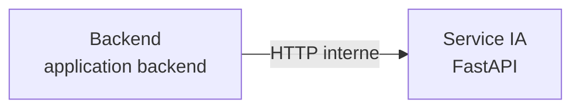

# Rapport d'architecture généré

**Statut :** COMPLETED

**Résumé :** Architecture générique produite au commit e9f2ee0d8bfc : style backend applicatif ; 2 composant(s), 1 flux et 0 contrôle(s) de conformité.

## Architecture proposée

**Style :** backend applicatif

### Diagramme des composants

### Composants détectés

| Composant | Type | Preuves |
| --- | --- | --- |
| Backend | application backend | backend/ |
| Service IA | FastAPI | FastAPI détecté dans le code/configuration |

### Flux détectés

| Source | Cible | Protocole | Preuve |
| --- | --- | --- | --- |
| Backend | Service IA | HTTP interne | Composants backend et FastAPI détectés. |

## Constats

- **LOW** — Décisions d'architecture non documentées : Ajouter un schéma des composants, les flux principaux et des ADR pour les décisions structurantes.
