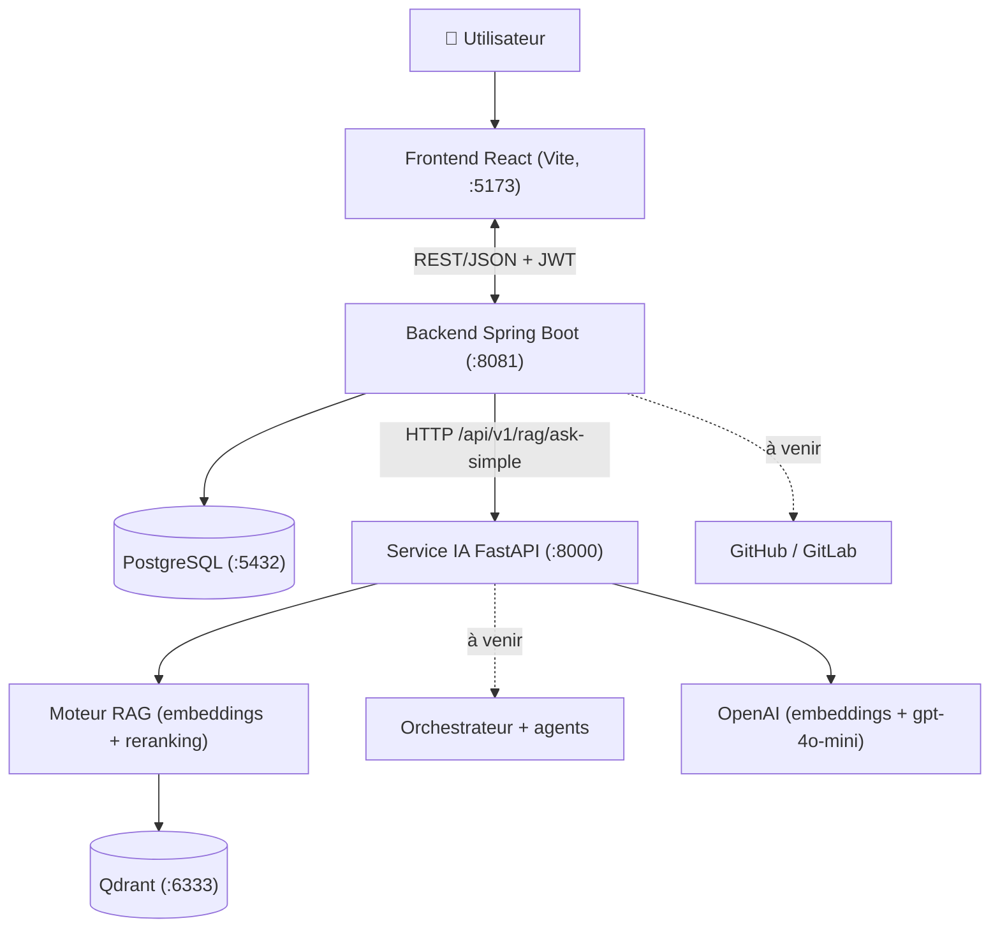
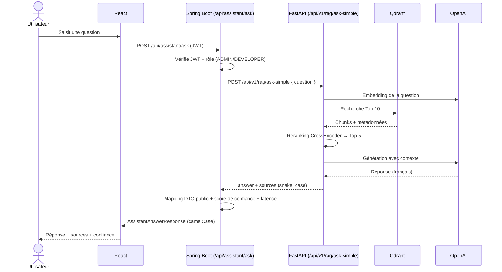

<div align="center">

# Engineering Copilot — SAE

**Copilote intelligent d'analyse, d'audit et de documentation des projets logiciels, basé sur l'IA multi-agents.**

Application web (frontend React + backend Spring Boot) qui constitue la **plateforme métier** d'Engineering Copilot et s'intègre au **microservice IA FastAPI** pour répondre aux questions techniques avec des réponses sourcées.

-blue)


</div>

> **Structure actuelle du monorepo :** ce dossier est uniquement le backend
> Spring Boot. Le frontend est dans [`../frontend`](../frontend), le service
> FastAPI dans [`../ai-service`](../ai-service) et Docker Compose dans
> [`../infra`](../infra). Utiliser le README racine comme référence de démarrage.

> **État du projet — Sprint 2 (en cours, à améliorer au Sprint 3).**
> Ce dépôt contient la partie **SAE** (React + Spring Boot + PostgreSQL). Le
> Sprint 2 livre le socle métier **et l'intégration au service IA** : un
> utilisateur peut poser une question technique depuis le frontend, la requête
> traverse Spring Boot, appelle le microservice FastAPI (`ask-simple`) et
> renvoie une réponse **sourcée avec numéros de page et score de confiance**.
> L'ingestion documentaire dynamique, l'orchestration multi-agents et les audits
> arrivent aux sprints suivants.

---

## Sommaire

- [1. Présentation](#1-présentation)
- [2. Périmètre du Sprint 2](#2-périmètre-du-sprint-2)
- [3. Architecture](#3-architecture)
- [4. Stack technique](#4-stack-technique)
- [5. Structure du dépôt](#5-structure-du-dépôt)
- [6. Prérequis](#6-prérequis)
- [7. Démarrage rapide](#7-démarrage-rapide)
- [8. Configuration](#8-configuration)
- [9. Intégration SAE ↔ IA (cœur du Sprint 2)](#9-intégration-sae--ia-cœur-du-sprint-2)
- [10. Référence API](#10-référence-api)
- [11. Rôles et contrôle d'accès (RBAC)](#11-rôles-et-contrôle-daccès-rbac)
- [12. Tests et vérification](#12-tests-et-vérification)
- [13. Statut des sprints et feuille de route](#13-statut-des-sprints-et-feuille-de-route)
- [14. Dépannage](#14-dépannage)
- [15. Documentation complémentaire](#15-documentation-complémentaire)
- [16. Licence](#16-licence)

---

## 1. Présentation

Engineering Copilot centralise la connaissance technique d'un projet logiciel,
analyse son dépôt Git et sa documentation, puis produit des **réponses
sourcées**, des audits, de la documentation et des TODO traçables.

La solution est **distribuée** en deux dépôts :

| Partie | Dépôt | Responsabilités |
| --- | --- | --- |
| **Backend** (ce dossier) | `backend` | Spring Boot, PostgreSQL, authentification/RBAC, gestion des utilisateurs, projets, repositories, documents et appel du service IA. |
| **Frontend** | `frontend` | Application React + Vite. |
| **IA** | `ai-service` | Microservice FastAPI : embeddings, Qdrant, reranking et génération RAG. |

> Le backend Spring Boot reste **la porte d'entrée de confiance** : il applique
> l'authentification, les rôles et les droits, puis appelle le service IA côté
> serveur. **Le frontend n'appelle jamais FastAPI directement.**

## 2. Périmètre du Sprint 2

### ✅ Livré dans ce dépôt

- Authentification **JWT** (login/register), sessions *stateless*, hachage BCrypt.
- **RBAC** par rôle : `ADMIN`, `MANAGER`, `DEVELOPER`, `ARCHITECT`, `QA`, `AUDITOR`.
- CRUD complet : utilisateurs, équipes, projets, repositories, documents,
  documentation, analyses, reviews, TODO, conversations.
- Dashboard et navigation par rôle.
- **Intégration IA (nouveau) :** page **Assistant** de type chat, appelant
  `POST /api/assistant/ask` → FastAPI `ask-simple`, avec **réponse, sources,
  numéros de page et score de confiance**.
- Client HTTP configurable (timeouts, retry contrôlé) et **traduction propre des
  erreurs IA** (400/422 → 400, réseau/5xx → 503).
- `docker-compose.yml` pour les dépendances (PostgreSQL + Qdrant).

### 🔜 À améliorer aux prochains sprints

- **Ingestion documentaire + embeddings déclenchés à la création d'un document**
  (action « create document » → IA `POST /api/v1/documents/ingest-path`).
- RAG **scopé par projet** (le service IA actuel répond sur le corpus
  documentaire partagé, pas encore sur le code d'un projet précis).
- Persistance systématique des échanges en `Conversation`, orchestrateur et
  agents (structure, architecture, sécurité, impact, documentation, TODO).
- Authentification service-à-service entre Spring Boot et FastAPI.

## 3. Architecture

### Vue générale



Le chemin d'intégration recommandé est strict :

```text
React  →  Spring Boot SAE  →  FastAPI IA  →  Qdrant / OpenAI
```

### Séquence d'une question à l'assistant



> Les diagrammes UML complets (cas d'utilisation, diagramme de classes,
> orchestration multi-agents) sont dans **[docs/ARCHITECTURE.md](docs/ARCHITECTURE.md)**.

## 4. Stack technique

| Couche | Technologies |
| --- | --- |
| Frontend | React 18, TypeScript, Vite 5, React Router 6, Axios, React Hook Form, TailwindCSS, lucide-react |
| Backend | Java 17, Spring Boot 4.1 (webmvc, security, data-jpa, validation, **restclient**), Lombok |
| Données | PostgreSQL (données métier), Qdrant (index vectoriel, côté IA) |
| Sécurité | JWT (HMAC-SHA256), BCrypt, RBAC Spring Security |
| IA (dépôt séparé) | FastAPI, LangChain, OpenAI `text-embedding-3-small` + `gpt-4o-mini`, CrossEncoder |

## 5. Structure du dépôt

```text
backend/
├── src/main/java/org/example/copilote/
│   ├── config/            # AiProperties, AiClientConfig (RestClient IA)  ← intégration
│   ├── client/            # AiRagClient (appel FastAPI ask-simple)        ← intégration
│   ├── controller/        # REST controllers (+ AssistantController)      ← intégration
│   ├── service/ + impl/   # Logique métier (+ AssistantService)           ← intégration
│   ├── dto/Request|Response/  # DTO publics (+ Assistant*)                ← intégration
│   ├── dto/ai/            # DTO internes du contrat IA (snake_case)       ← intégration
│   ├── entity/            # Entités JPA + enums
│   ├── repository/        # Spring Data JPA
│   ├── security/          # JWT, filtre, SecurityConfig, RBAC
│   └── exception/         # GlobalExceptionHandler (+ 503 IA)             ← intégration
├── src/main/resources/application.properties   # + config ai.service.*   ← intégration
├── frontend/
│   └── src/
│       ├── pages/AssistantPage.tsx              # page chat assistant      ← intégration
│       ├── services/assistantService.ts         # appel /api/assistant     ← intégration
│       ├── types/assistant.ts                   # types réponse IA         ← intégration
│       ├── lib/api.ts / lib/workspace.ts         # axios + navigation
│       └── ...
├── docker-compose.yml     # PostgreSQL + Qdrant                          ← intégration
├── docs/                  # ARCHITECTURE, INTEGRATION_IA, SPRINT2         ← intégration
└── README.md
```

## 6. Prérequis

- **Java 17+** et Maven (le wrapper `mvnw` est fourni, pas besoin d'installer Maven).
- **Node.js 18+** et npm.
- **PostgreSQL** (ou Docker pour le lancer via `docker-compose.yml`).
- Le **service IA FastAPI** en fonctionnement pour l'assistant — voir le dépôt
  `ai-service` (nécessite une clé OpenAI et une collection Qdrant).

## 7. Démarrage rapide

### 7.1 Dépendances (PostgreSQL + Qdrant)

```bash
docker compose up -d
```

> À défaut de Docker, installez PostgreSQL et créez la base `copilote_db`
> (identifiants dans `application.properties`).

### 7.2 Service IA FastAPI (dépôt séparé)

```powershell
cd ../ai-service
python -m venv venv ; .\venv\Scripts\Activate.ps1
pip install -r requirements.txt
Copy-Item .env.example .env   # renseigner OPENAI_API_KEY, QDRANT_URL, ...
python -m uvicorn app.main:app --reload --host 0.0.0.0 --port 8000
```

Vérifier : `http://localhost:8000/health` → `{"status":"ok"}`.

### 7.3 Backend Spring Boot

```bash
# depuis la racine du dépôt SAE
./mvnw spring-boot:run          # Windows : mvnw.cmd spring-boot:run
```

API sur `http://localhost:8081`. Un compte **ADMIN** est créé au démarrage
(`admin@copilote.dev` / `Admin12345!`, voir `application.properties`).

### 7.4 Frontend React

```bash
cd frontend
cp .env.example .env            # optionnel (valeur par défaut = http://localhost:8081)
npm install
npm run dev
```

Interface sur `http://localhost:5173`. Connectez-vous, puis ouvrez **Assistant**
dans la barre latérale (rôles `ADMIN` ou `DEVELOPER`).

## 8. Configuration

### Backend (`application.properties` / variables d'environnement)

| Clé | Défaut | Rôle |
| --- | --- | --- |
| `server.port` | `8081` | Port du backend |
| `spring.datasource.url` | `jdbc:postgresql://localhost:5432/copilote_db` | Base PostgreSQL |
| `ai.service.base-url` | `${AI_SERVICE_BASE_URL:http://localhost:8000}` | **URL du service IA** (lue depuis l'env, non codée en dur) |
| `ai.service.connect-timeout` | `5s` | Timeout de connexion vers l'IA |
| `ai.service.response-timeout` | `90s` | Timeout de réponse (couvre le 1er chargement du reranker) |

### Frontend (`frontend/.env`)

| Clé | Défaut | Rôle |
| --- | --- | --- |
| `VITE_API_BASE_URL` | `http://localhost:8081` | URL du backend Spring Boot |

## 9. Intégration SAE ↔ IA (cœur du Sprint 2)

L'assistant est le **seul point** où le backend appelle le service IA. La chaîne
respecte le contrat de handoff défini côté IA (`docs/ROUTAGE_SAE_IA.md` du dépôt
`ai-service`).

**Côté backend :**

- `config/AiProperties` + `config/AiClientConfig` : un bean `RestClient` nommé
  `aiRestClient`, avec URL de base et timeouts configurables.
- `client/AiRagClient` : appelle `POST /api/v1/rag/ask-simple`, applique
  **au plus un retry** (uniquement réseau / `502` / `503`), et traduit les
  erreurs (`400/422` → `IllegalArgumentException` → HTTP 400 ;
  réseau/5xx → `AiServiceUnavailableException` → HTTP 503).
- `dto/ai/*` : DTO internes mappant le JSON **snake_case** de l'IA
  (`page_number`, `chunks_used`, `rerank_score`…) via `@JsonProperty`, tolérants
  aux champs inconnus (`@JsonIgnoreProperties`).
- `service/AssistantService` : mesure la latence, journalise l'action (audit),
  calcule un **score de confiance** interprétable et mappe vers un **DTO public
  distinct** (`AssistantAnswerResponse`, camelCase).
- `controller/AssistantController` : `POST /api/assistant/ask` et
  `GET /api/assistant/health` (le préfixe `/api/assistant/**` est déjà restreint
  à `ADMIN`/`DEVELOPER` dans `SecurityConfig`).

**Score de confiance** — dérivé du **meilleur score d'embedding (cosinus)** des
sources, borné à `[0,1]`. Les scores du CrossEncoder ne sont **pas** utilisés :
ils sont non bornés et peuvent être négatifs (seul leur classement compte).

**Côté frontend :**

- `types/assistant.ts`, `services/assistantService.ts`, `pages/AssistantPage.tsx` :
  interface de chat affichant réponse, **sources (fichier + page + score)**,
  badge de confiance (avec avertissement si faible) et état du service IA.

> Détails complets, contrats et codes d'erreur : **[docs/INTEGRATION_IA.md](docs/INTEGRATION_IA.md)**.

## 10. Référence API

### Endpoint d'intégration IA (nouveau)

| Méthode | Route | Rôles | Description |
| --- | --- | --- | --- |
| `POST` | `/api/assistant/ask` | ADMIN, DEVELOPER | Pose une question ; renvoie réponse + sources + confiance. |
| `GET` | `/api/assistant/health` | ADMIN, DEVELOPER | État de disponibilité du service IA. |

**Requête** `POST /api/assistant/ask`
```json
{ "question": "Quelles sont les bonnes pratiques de Spring Boot ?" }
```

**Réponse** `200 OK`
```json
{
  "question": "Quelles sont les bonnes pratiques de Spring Boot ?",
  "answer": "Réponse générée en français…",
  "sources": [
    { "source": "framework_docs/spring-boot-reference.pdf",
      "displayName": "spring-boot-reference.pdf",
      "pageNumber": 202, "score": 0.72, "chunkId": "spring-boot-reference_p202_0" }
  ],
  "confidence": 0.72,
  "chunksUsed": 5,
  "responseTimeMs": 1840,
  "collectionName": "exp_openai_text_embedding_3_small",
  "framework": "langchain",
  "rerankerType": "cross_encoder"
}
```

### Principaux endpoints métier (existants)

| Domaine | Exemples |
| --- | --- |
| Auth | `POST /api/auth/login`, `POST /api/auth/register` |
| Utilisateurs | `GET/POST/PUT/DELETE /api/users`, `GET /api/users/me` |
| Projets / Repos / Docs | `/api/projects`, `/api/repositories`, `/api/documents`, `/api/documentation` |
| Analyses / Reviews / TODO | `/api/analyses`, `/api/reviews`, `/api/todos` |
| Conversations | `/api/conversations` (CRUD de l'historique) |
| Dashboard | `GET /api/dashboard/overview` |

## 11. Rôles et contrôle d'accès (RBAC)

| Rôle | Accès principal |
| --- | --- |
| `ADMIN` | Administration complète, utilisateurs, équipes, **assistant** |
| `MANAGER` | Projets, documents, analyses, rapports, sprint |
| `DEVELOPER` | Projets, documents, TODO, conversations, **assistant** |
| `ARCHITECT` | Architecture, dépendances, impact, documentation |
| `QA` | Analyses, qualité, sécurité, reviews |
| `AUDITOR` | Lecture étendue, reviews |

L'autorisation est appliquée dans `SecurityConfig` (backend) et par
`RoleGuard` / `workspaceModules` (frontend). L'assistant est réservé à
`ADMIN` et `DEVELOPER`.

## 12. Tests et vérification

### Frontend

```bash
cd frontend
npm run build        # tsc --noEmit + vite build  ✅ vérifié
```

### Backend

```bash
./mvnw test          # tests Spring
./mvnw compile       # compilation seule
```

### Vérification de bout en bout (manuelle)

1. Lancer Qdrant + PostgreSQL, le service IA (`:8000`), le backend (`:8081`), le frontend (`:5173`).
2. Se connecter, ouvrir **Assistant**, poser une question.
3. Vérifier que la réponse contient un **answer**, des **sources** et un **numéro de page**.
4. Couper le service IA → l'assistant doit afficher une erreur **503** propre (pas de détail interne).

## 13. Statut des sprints et feuille de route

| Sprint | Contenu | État |
| --- | --- | --- |
| S1 | Auth, RBAC, utilisateurs, équipes, projets | ✅ |
| **S2** | **Socle métier + intégration IA (assistant sourcé)** | 🟦 **en cours (ce livrable)** |
| S3 | Ingestion à la création d'un document, RAG par projet, orchestrateur + agents | ⏳ |
| S4 | Audits, documentation générée, TODO, dashboards avancés, déploiement | ⏳ |

> **Note d'implémentation (demandée) :** l'**ingestion documentaire et le calcul
> des embeddings** seront déclenchés par l'**action de création d'un document**
> (`create document`), qui appellera l'IA `POST /api/v1/documents/ingest-path`.
> Le RAG deviendra alors interrogeable par projet. Prévu au Sprint 3.

## 14. Dépannage

| Symptôme | Cause probable | Solution |
| --- | --- | --- |
| Assistant → « AI service unavailable » (503) | Service IA non démarré | Lancer FastAPI sur `:8000`, vérifier `/health` |
| 403 sur `/api/assistant/ask` | Rôle non autorisé | Se connecter en `ADMIN` ou `DEVELOPER` |
| 401 partout | JWT manquant/expiré | Se reconnecter |
| Timeout à la 1re question | Chargement initial du CrossEncoder | Normal ; `ai.service.response-timeout=90s` couvre ce cas |
| CORS bloqué | Frontend hors origines autorisées | Vérifier `SecurityConfig` (`localhost:5173/4173`) |
| Le backend ne trouve pas l'IA | Mauvaise URL | Définir `AI_SERVICE_BASE_URL` |

## 15. Documentation complémentaire

| Document | Contenu |
| --- | --- |
| [docs/ARCHITECTURE.md](docs/ARCHITECTURE.md) | Diagrammes UML (cas d'utilisation, classes, orchestration multi-agents), responsabilités par composant |
| [docs/INTEGRATION_IA.md](docs/INTEGRATION_IA.md) | Contrat détaillé SAE ↔ IA côté backend : DTO, erreurs, retry, sécurité |
| [docs/SPRINT2.md](docs/SPRINT2.md) | Checklist d'acceptation du Sprint 2 et corrections apportées |

## 16. Licence

Distribué sous licence **MIT**.
