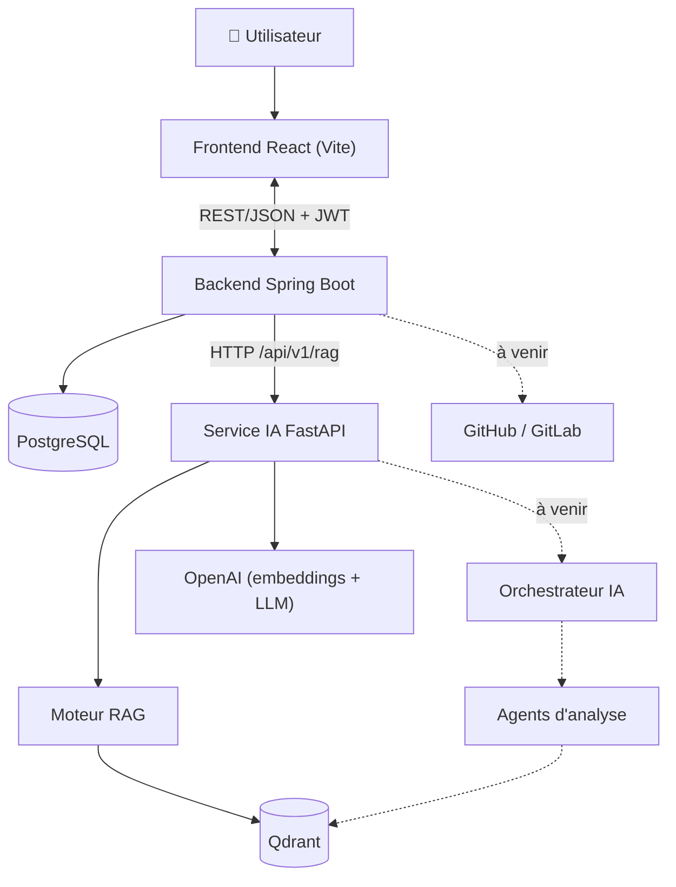
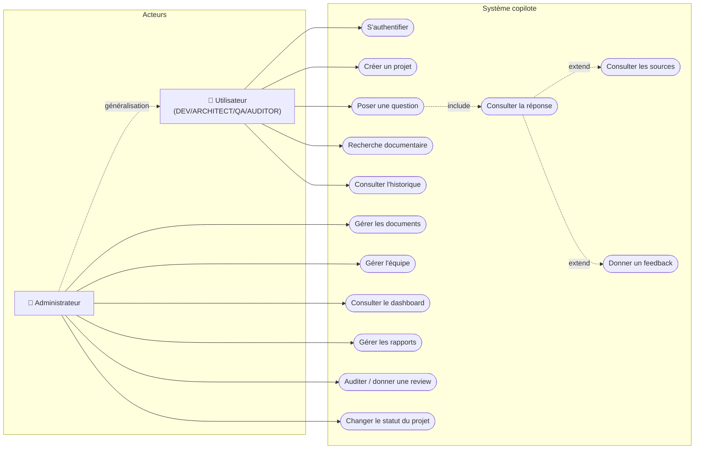
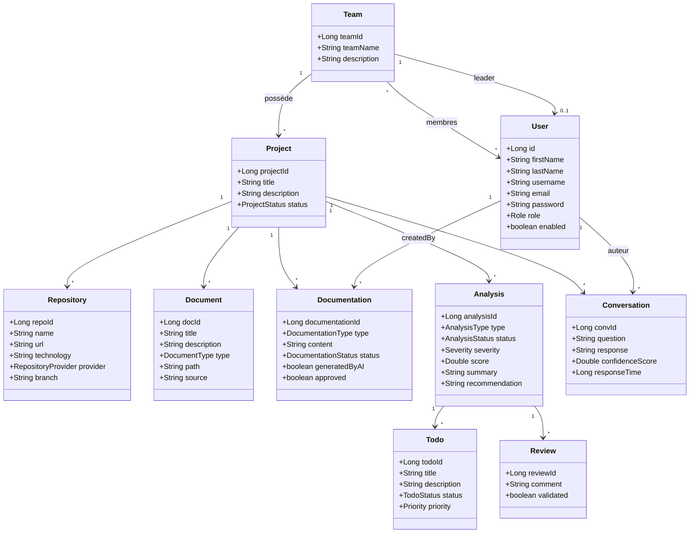
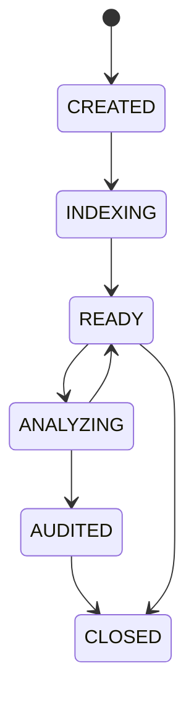
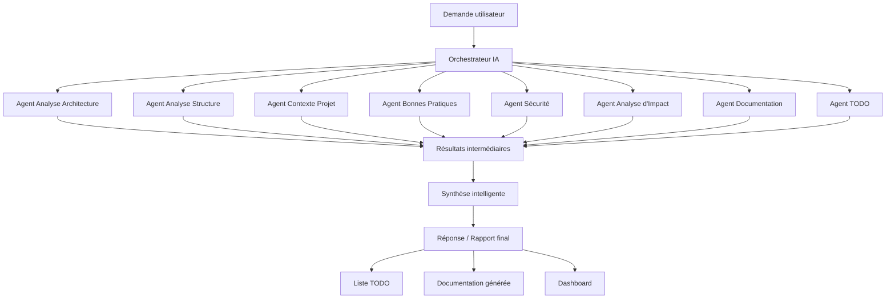

# Architecture — Engineering Copilot (SAE)

Ce document rassemble les vues d'architecture de la plateforme et reproduit, en
Mermaid, les diagrammes UML fournis dans le cahier des charges et la
présentation. Il complète le [README](../README.md) et
[INTEGRATION_IA.md](INTEGRATION_IA.md).

---

## 1. Architecture générale



### Responsabilités par composant

| Composant | Responsabilités | Interfaces |
| --- | --- | --- |
| Frontend React | Dashboard, administration, projets, documents, chat assistant, rapports | REST/JSON |
| Backend Spring Boot | Authentification, RBAC, API métier, persistance, appel du service IA | PostgreSQL, service IA, Git |
| Service IA FastAPI | RAG (embeddings, retrieval, reranking, génération), à venir orchestration/agents | Qdrant, OpenAI, backend |
| PostgreSQL | Utilisateurs, équipes, projets, documents, analyses, conversations | Transactions JPA |
| Qdrant | Index vectoriels du corpus documentaire | Collections cloisonnées |

---

## 2. Diagramme de cas d'utilisation

> Reproduction simplifiée de la *Figure 1* (source PDF). Le PDF reste la
> référence graphique.



---

## 3. Diagramme de classes métier

Reproduction de la *Figure 5* alignée sur le **modèle réellement implémenté**
dans `entity/`. Le backend étend le modèle du cahier (entité `Documentation`,
horodatage `createdAt`/`updatedAt`, statuts additionnels).



### Énumérations

| Énumération | Valeurs |
| --- | --- |
| `Role` | DEV*/DEVELOPER, ARCHITECT, QA, ADMIN, AUDITOR, MANAGER |
| `ProjectStatus` | CREATED, INDEXING, ANALYZING, READY, AUDITED, CLOSED |
| `DocumentType` | PDF, DOCX, HTML, MD, WIKI |
| `AnalysisType` | PROJECT_STRUCTURE, PROJECT_CONTEXT, BEST_PRACTICES, SECURITY, STANDARDS, CODE_REVIEW, IMPACT_ANALYSIS, DOCUMENTATION |
| `Severity` | LOW, MEDIUM, HIGH, CRITICAL |
| `TodoStatus` | OPEN, IN_PROGRESS, DONE, REJECTED |

> Le backend définit aussi `RepositoryProvider`, `DocumentationType`,
> `DocumentationStatus`, `AnalysisStatus`, `ReviewStatus` et `Priority`
> (valeurs dans `entity/`).

### Machine d'état d'un projet



---

## 4. Orchestration IA multi-agents (cible — Sprint 3+)

> Reproduction de la *Figure 4*. **Non implémenté au Sprint 2** : le service IA
> expose aujourd'hui le pipeline RAG (`ask-simple`). L'orchestrateur et les
> agents sont la cible des prochains sprints.



---

## 5. Pipeline RAG (côté IA, existant)

```text
Question
  → text-embedding-3-small (OpenAI)
  → recherche Qdrant Top 10
  → reranking CrossEncoder (ms-marco-MiniLM-L-6-v2)
  → Top 5 chunks
  → génération gpt-4o-mini (réponse en français)
  → réponse + fichiers sources + numéros de page
```

Le backend SAE consomme ce pipeline via la route `POST /api/v1/rag/ask-simple`
(voir [INTEGRATION_IA.md](INTEGRATION_IA.md)).
