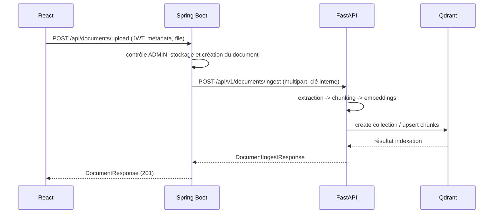

# Contrat de routage SAE - IA

## Responsabilités

| Couche | Responsabilité |
| --- | --- |
| React | Interface utilisateur ; appelle uniquement Spring Boot avec le JWT utilisateur |
| Spring Boot | Authentification, rôles, projets, stockage des fichiers, PostgreSQL et point d'entrée public |
| FastAPI | Extraction, chunking, embeddings, Qdrant, RAG ; service interne uniquement |
| Qdrant | Vecteurs et métadonnées de chunks |

## Règle de sécurité

Chaque appel Spring -> FastAPI contient `X-Internal-Api-Key`. Cette valeur est `AI_INTERNAL_API_KEY`, identique dans les deux `.env` et jamais versionnée. Les routes RAG et ingestion FastAPI refusent un appel sans cette clé.

## Séquence d'upload et d'indexation



## Routes actives

| Côté public Spring | Rôle | Appel interne IA |
| --- | --- | --- |
| `POST /api/assistant/ask` | question RAG du frontend | `POST /api/v1/rag/ask-simple` |
| `GET /api/assistant/health` | disponibilité RAG/Qdrant | `GET /api/v1/rag/health` |
| `POST /api/documents/upload` | création avec fichier | `POST /api/v1/documents/ingest` |
| `POST /api/documents` | métadonnées sans fichier | aucun |

## Contraintes d'ingestion

- Formats : PDF, DOCX, TXT, MD, HTML/HTM.
- Taille : 10 Mo côté Spring et FastAPI par défaut.
- Le navigateur ne stocke plus les fichiers dans `localStorage`.
- FastAPI ne reçoit jamais un chemin de fichier fourni par le navigateur.
- Le client ne peut pas choisir une collection Qdrant ni demander sa suppression.

## Configuration

```text
backend/.env
  AI_INTERNAL_API_KEY=<secret commun>
  AI_SERVICE_BASE_URL=http://localhost:8000

ai-service/.env
  AI_INTERNAL_API_KEY=<même secret>
  DOCUMENT_COLLECTION=documents_openai_text_embedding_3_small
```

Pour le futur filtrage par projet, FastAPI indexe déjà les nouveaux fichiers sous la catégorie `project_<projectId>`.
