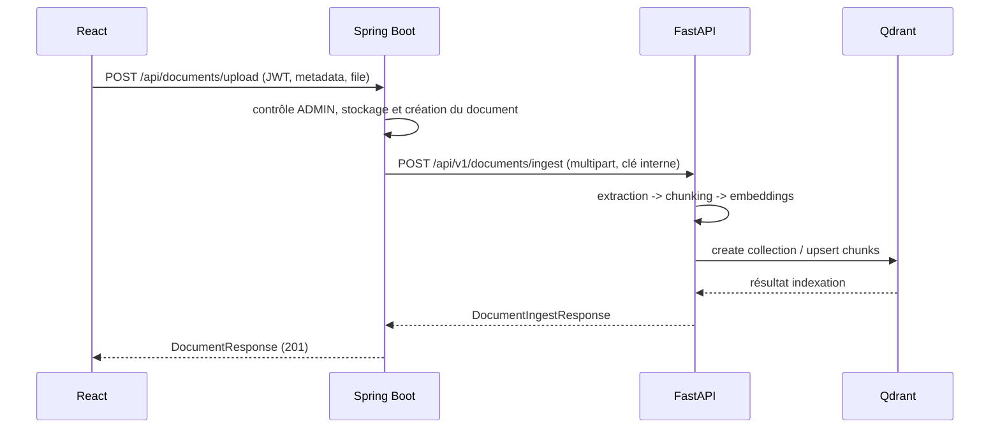

# Contrat de routage SAE - IA

## Responsabilités

| Couche | Responsabilité |
| --- | --- |
| React | Interface utilisateur ; appelle uniquement Spring Boot avec le JWT utilisateur |
| Spring Boot | Authentification, rôles, projets, stockage des fichiers, PostgreSQL et point d'entrée public |
| FastAPI | Extraction, chunking, embeddings, Qdrant, RAG ; service interne uniquement |
| Qdrant | Vecteurs et métadonnées de chunks |

## Règle de sécurité

Chaque appel Spring -> FastAPI contient `X-Internal-Api-Key`. Cette valeur est `AI_INTERNAL_API_KEY`, identique dans les deux `.env` et jamais versionnée. Les routes RAG et ingestion FastAPI refusent un appel sans cette clé.

## Séquence d'upload et d'indexation



## Routes actives

| Côté public Spring | Rôle | Appel interne IA |
| --- | --- | --- |
| `POST /api/assistant/ask` | question RAG du frontend | `POST /api/v1/rag/ask-simple` |
| `GET /api/assistant/health` | disponibilité RAG/Qdrant | `GET /api/v1/rag/health` |
| `POST /api/documents/upload` | création avec fichier | `POST /api/v1/documents/ingest` |
| `POST /api/documents` | métadonnées sans fichier | aucun |
| `POST /api/analyses/run` | démarre un audit asynchrone sur un dépôt GitHub public du projet | `POST /api/v1/analyses/run` |

## Audit multi-agents Sprint 3

1. React envoie `projectId`, `repositoryId`, le profil d'architecture optionnel
   et les règles au backend avec le JWT utilisateur.
2. Spring vérifie le rôle, l'appartenance dépôt-projet et le fournisseur GitHub,
   crée `Analysis(FULL_AUDIT, RUNNING)` puis retourne `202 Accepted`.
3. Le worker Spring appelle FastAPI avec `X-Internal-Api-Key`, le scope du dépôt
   et un `correlationId`. Aucun JWT ou chemin local n'est transmis.
4. FastAPI exécute les agents de fondation en lecture seule. Spring persiste le
   résultat structuré, la synthèse, le score et l'état `COMPLETED` ou `FAILED`.

Les résultats ne créent jamais de TODO automatiquement : une revue humaine reste
obligatoire avant toute action métier.

> Pour une base PostgreSQL créée avant Sprint 3, exécuter une fois la migration
> `docs/migrations/V20260725_01__add_full_audit_analysis_type.sql` avant le
> premier audit `FULL_AUDIT`.
>
> Après les migrations de type d'analyse, appliquer aussi
> `docs/migrations/V20260726_01__reviewable_todo_proposals.sql` avant d'utiliser
> la revue de findings, les propositions TODO ou la publication vers la connaissance.

## Contraintes d'ingestion

- Formats : PDF, DOCX, TXT, MD, HTML/HTM.
- Taille : 10 Mo côté Spring et FastAPI par défaut.
- Le navigateur ne stocke plus les fichiers dans `localStorage`.
- FastAPI ne reçoit jamais un chemin de fichier fourni par le navigateur.
- Le client ne peut pas choisir une collection Qdrant ni demander sa suppression.

## Configuration

```text
backend/.env
  AI_INTERNAL_API_KEY=<secret commun>
  AI_SERVICE_BASE_URL=http://localhost:8000

ai-service/.env
  AI_INTERNAL_API_KEY=<même secret>
  DOCUMENT_COLLECTION=documents_openai_text_embedding_3_small
```

Pour le futur filtrage par projet, FastAPI indexe déjà les nouveaux fichiers sous la catégorie `project_<projectId>`.
## Sprint 3 — actions humaines après audit

- `POST /api/analyses/impact` : action explicite, crée une analyse `IMPACT` et exécute seulement l'agent d'impact ; elle ne relance pas l'audit complet.
- `GET /api/analyses/{id}/findings` : constats persistés et attribuables à un agent.
- Une revue `ACCEPTED` est obligatoire avant toute proposition TODO ou publication de connaissance.
- `POST /api/analyses/{id}/todo-proposals/confirm` : création seulement après confirmation explicite côté interface.
- `POST /api/analyses/{id}/findings/{findingKey}/knowledge` : Admin/QA uniquement ; transforme un constat approuvé en document Markdown projet puis l'indexe avec la clé interne SAE → IA. Les constats non validés ne sont jamais envoyés à Qdrant.
