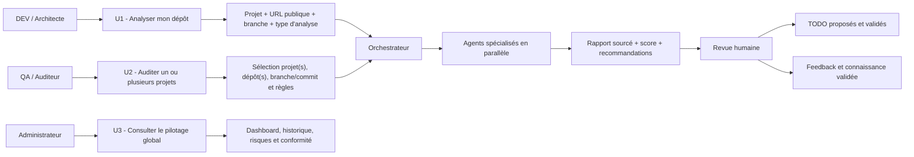
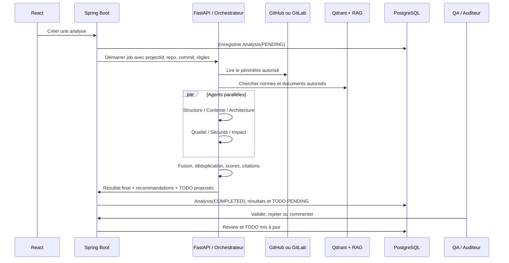

# Sprint 3 - Architecture multi-agents

## Objectif

Fournir des audits de projets explicables, traçables et soumis à validation humaine. L'IA propose des constats, recommandations et TODO ; elle ne modifie ni le dépôt ni les données métier sans validation explicite.

Le RAG de Sprint 2 reste la source documentaire commune. Les options de query rewriting, expansion et retrieval hiérarchique restent désactivées : la baseline a donné les meilleurs résultats de qualité et de latence.

## Cas d'utilisation



### U1 - Analyse individuelle

Le DEV ou l'ARCHITECT crée/choisit un projet, fournit un dépôt public et sélectionne une branche ou un commit. L'orchestrateur lance les agents appropriés. Chaque constat doit identifier le chemin, la ligne ou l'extrait concerné. Les TODO restent proposés jusqu'à validation.

### U2 - Audit équipe

Le QA, l'AUDITOR ou l'ADMIN sélectionne un ou plusieurs projets/dépôts et un périmètre d'audit. Les résultats sont consolidés par projet et par sévérité. Les commentaires de revue sont historisés. Une remarque ne peut être partagée avec le propriétaire du dépôt ou ajoutée à la base de connaissance qu'après validation humaine.

### U3 - Administration

L'ADMIN suit les analyses, risques, délais, normes appliquées, taux de validation des recommandations et historique par projet. L'ADMIN gère aussi les règles et les sources de connaissance autorisées.

## Agents

| Agent | Responsabilité | Sortie principale |
| --- | --- | --- |
| `structure_agent` | Dossiers, packages, fichiers, composants | carte de structure, anomalies d'organisation |
| `context_agent` | Technologies, objectifs, modules, dépendances | fiche de contexte projet |
| `architecture_agent` | Couches, styles, dépendances et flux ; contrôle optionnel contre le cahier des charges | carte Mermaid, composants, flux et écarts sourcés |
| `quality_agent` | Clean Code, SOLID, conventions et normes | constats et recommandations qualité |
| `security_agent` | OWASP, secrets, dépendances et risques | risques classés LOW à CRITICAL |
| `impact_agent` | Erreurs, zones affectées et tests à vérifier | analyse d'impact et preuves |
| `documentation_agent` | README, guides et documentation technique | document versionné avec citations |
| `todo_agent` | Transformation des constats validés | TODO priorisés, localisés et justifiés |
| `orchestrator` | Planification, parallélisation, fusion et synthèse | rapport final et état du job |

## Flux d'exécution



## Contrat minimal entre SAE et IA

### Demande d'analyse

```json
{
  "analysisId": 42,
  "projectId": 7,
  "repository": {
    "url": "https://github.com/organisation/projet",
    "branch": "main",
    "commit": "optional-immutable-sha"
  },
  "requestedAgents": ["structure", "context", "quality", "security"],
  "rules": ["OWASP_ASVS", "SOLID", "INTERNAL_JAVA_STANDARD"],
  "requestedBy": 15,
  "correlationId": "uuid"
}
```

### Sortie agent normalisée

```json
{
  "agent": "security",
  "status": "COMPLETED",
  "summary": "Une clé potentiellement exposée a été détectée.",
  "findings": [
    {
      "title": "Secret dans la configuration",
      "severity": "HIGH",
      "confidence": 0.86,
      "location": {"path": "backend/src/main/resources/application.properties", "lineStart": 12, "lineEnd": 12},
      "evidence": "Extrait masqué et règle appliquée",
      "recommendation": "Déplacer le secret vers une variable d'environnement.",
      "sources": [{"type": "rule", "reference": "OWASP ASVS"}]
    }
  ],
  "modelTrace": {"model": "configured-model", "durationMs": 0}
}
```

`confidence` est obligatoire. Une recommandation sans preuve doit être marquée comme hypothèse. Les secrets ne sont jamais renvoyés dans `evidence`.

## États et validation humaine

```text
PENDING -> RUNNING -> PARTIAL | COMPLETED | FAILED
COMPLETED -> UNDER_REVIEW -> VALIDATED | REJECTED
VALIDATED -> TODO_CREATED (si l'utilisateur confirme)
```

- Un timeout d'agent produit un résultat `PARTIAL`, jamais un rapport présenté comme complet.
- Le `todo_agent` ne crée pas directement une tâche dans PostgreSQL : il renvoie une proposition.
- Spring Boot valide les droits, persiste `Analysis`, `Review` et `Todo`, et reste le seul accès public au service IA.
- Les documents et le code sont des données non fiables : leurs instructions sont neutralisées et signalées.

## Ordre d'implémentation Sprint 3

Le plan détaillé, les critères de sortie et la matrice des fournisseurs sont décrits dans [SPRINT3_IMPLEMENTATION_PLAN.md](SPRINT3_IMPLEMENTATION_PLAN.md).

1. Contrats Pydantic, état de job et orchestrateur minimal.
2. `structure_agent` et `context_agent` sur un dépôt public limité.
3. `quality_agent` et `security_agent` avec règles versionnées et sorties sourcées.
4. Consolidation, persistance d'analyse et UI de consultation.
5. `todo_agent` avec validation QA/ADMIN obligatoire.
6. Documentation, impact, dashboard multi-projets et métriques.

**État d'implémentation IA :** les huit agents sont présents et testés. Les
agents `structure`, `context`, `architecture`, `quality` et `security` peuvent
être lancés pour un audit de dépôt. `impact` exige une demande de modification
et des chemins, `documentation` génère une fiche depuis le code et les
manifests, et `todo` exige des constats approuvés par une revue humaine. Leur
connexion au workflow Spring Boot est réalisée pour l'audit fondation : Spring
crée un `Analysis(FULL_AUDIT, RUNNING)`, transmet uniquement le scope de dépôt
au endpoint FastAPI interne, puis persiste la synthèse et les résultats
structurés. React permet de lancer le run et de consulter le résultat par agent.

### Règle de priorité confirmée

L'intégration SAE–IA de l'audit fondation est réalisée après la validation des
agents. Elle est asynchrone, conserve un `correlationId`, reste limitée au
dépôt sélectionné et ne crée aucune TODO automatiquement. Les agents `impact`,
`documentation` et `todo` gardent leurs préconditions spécifiques (demande de
changement ou constats revus) avant leur branchement dans le workflow public.

### Architecture générée et conformité

`architecture_agent` produit désormais un artefact structuré : composants,
flux, style d'architecture et diagramme Mermaid. Par défaut il décrit le dépôt
sans imposer d'architecture. Le profil explicite `engineering_copilot` ajoute
neuf contrôles issus du cahier des charges et de la présentation : frontend
React, backend Spring Boot, FastAPI, PostgreSQL, Qdrant/RAG, gestion
documentaire par projet, huit agents, Review/TODO humain.

Un profil de conformité ne doit être activé que pour le dépôt dont il exprime
les exigences. Pour un dépôt tiers, l'agent reste en mode générique.

Les agents `architecture`, `documentation` et `impact` restent dans le périmètre Sprint 3, mais ne doivent être activés qu'après validation du socle d'analyse et des contrats ci-dessus.
