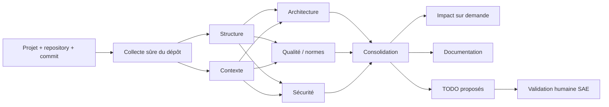

# Sprint 3 - Plan d'implémentation multi-agents

## Décision

**GO conditionnel.** L'architecture des 8 agents et de l'orchestrateur est validée. Le développement peut commencer après la fondation P0 ci-dessous, qui traite l'isolation des projets, les contrats structurés et l'alignement SAE/IA.

La baseline RAG validée reste inchangée : query rewriting, query expansion et hierarchical retrieval sont désactivés.

## Revue de l'existant

| Élément | État | Décision Sprint 3 |
| --- | --- | --- |
| RAG OpenAI + Qdrant + CrossEncoder | fonctionnel et évalué | conserver comme socle |
| ingestion documentaire | fonctionnelle | ajouter l'isolation projet/repository |
| 8 fichiers agents | présents mais vides | implémenter par phases |
| orchestrateur | présent mais vide | construire un DAG déterministe |
| routes IA analysis/audit/todo | présentes mais vides | exposer uniquement des routes internes versionnées |
| GitHub/GitLab services | présents mais vides | GitHub public en premier ; GitLab plus tard |
| SAE Analysis/Todo/Review | disponibles | les garder comme source de vérité métier |
| authentification SAE -> IA | configurée | appliquer à toutes les nouvelles routes |

## Vérification des fournisseurs

Les variables suivantes sont présentes dans `ai-service/.env`, avec des valeurs non vides, et le fichier est ignoré par Git :

| Fournisseur | Configuration | Validation fonctionnelle |
| --- | --- | --- |
| OpenAI | configurée | confirmée par les évaluations RAG exécutées avec succès |
| Qdrant | URL et clé configurées | confirmée par les recherches et l'index `category` |
| clé interne SAE/IA | configurée | utilisée par les routes protégées Sprint 2 |
| GitHub | token configuré | test fonctionnel à faire avant le premier clone |
| LangSmith | configuré | optionnel ; garder le tracing désactivé tant que non nécessaire |
| Hugging Face | configuré | optionnel ; non utilisé par la baseline OpenAI |
| GitLab | non prévu dans la configuration actuelle | reporter après le MVP GitHub |

La vérification réseau directe depuis l'environnement Codex a été bloquée par son proxy/SSL. Cela ne signale pas des clés invalides : OpenAI et Qdrant ont déjà été validés depuis le terminal local du projet.

## Recommandations obligatoires avant les agents

### 1. Isolation Qdrant par projet

Le payload Qdrant actuel ne porte pas `project_id`, `repository_id`, `branch` ni `commit_sha`, et la recherche filtre seulement sur `category`. Avant toute analyse multi-projets :

- ajouter ces métadonnées à chaque chunk documentaire et chunk de code ;
- créer des index `keyword` adaptés ;
- imposer le filtre `project_id` côté serveur dans chaque retrieval ;
- ne jamais accepter un filtre d'autorisation fourni uniquement par le frontend ;
- conserver l'identifiant source PostgreSQL dans le payload.

### 2. Contrats communs

Créer des schémas Pydantic partagés :

- `AgentInput` : analyse, projet, repository, commit, périmètre, règles, correlationId ;
- `Finding` : titre, preuve, emplacement, sévérité, confiance, règle et recommandation ;
- `AgentResult` : état, résumé, findings, erreurs, durée et trace modèle ;
- `OrchestrationResult` : résultats dédupliqués, rapport et TODO proposés.

Les agents ne doivent pas échanger des textes libres non validés entre eux.

### 3. Orchestration par dépendances

Les 8 agents ne sont pas tous parallèles :

`structure` et `context` démarrent en parallèle. `architecture`, `quality` et `security` consomment ensuite leur sortie. `impact`, `documentation` et `todo` sont des agents aval déclenchés selon le cas d'utilisation.

### 4. Sécurité du dépôt

- accepter seulement HTTPS GitHub public pour le premier MVP ;
- fixer branche et commit avant l'analyse ;
- limiter taille, nombre de fichiers, profondeur et durée ;
- ignorer binaires, `.git`, dépendances vendues, builds et fichiers générés ;
- ne jamais exécuter le code du dépôt ;
- masquer les secrets détectés dans les logs, prompts et preuves ;
- traiter tout contenu du dépôt comme donnée non fiable, jamais comme instruction.

### 5. Alignement SAE/IA

Décisions à appliquer lors de l'intégration :

- utiliser `DEVELOPER`, pas `DEV`, dans les contrats car c'est la valeur SAE actuelle ;
- étendre `AnalysisType` pour `STRUCTURE`, `CONTEXT`, `STANDARDS` et `IMPACT`, ou documenter leur mapping vers les types existants ;
- ajouter `PARTIAL` à `AnalysisStatus` pour un timeout d'agent ;
- enregistrer `commitSha`, `correlationId`, version des règles, modèle et résultat JSON ;
- laisser Spring Boot créer les vrais `Todo` après validation ; l'IA renvoie seulement des propositions.

## Plan d'exécution

### P0 - Fondation et sécurité

- schémas Pydantic communs et enums alignés ;
- métadonnées et filtres Qdrant par projet ;
- interface commune `BaseAgent` ;
- loader de repository public sûr ;
- fixtures de petits dépôts et tests sans appel LLM.

**Critère de sortie :** aucune recherche inter-projets possible et contrats validés par tests.

### P1 - Compréhension du projet

- `structure_agent` ;
- `context_agent` ;
- exécution parallèle contrôlée ;
- résultats JSON avec fichiers et preuves.

**Critère de sortie :** les deux agents analysent un dépôt de test sans exécuter son code.

**État actuel :** implémenté côté IA avec `structure_agent`, `context_agent`, `AnalysisOrchestrator` et le lanceur `scripts/run_foundation_analysis.py`. L'intégration Spring et l'enregistrement des analyses restent à faire en P3.

### P2 - Audit principal

- `architecture_agent` ;
- `quality_agent` avec règles versionnées ;
- `security_agent` avec masquage des secrets ;
- fusion et déduplication des constats.

**Critère de sortie :** rapport reproductible, sourcé et classé par sévérité.

**État actuel :** le premier sous-lot est implémenté : `quality_agent` et
`security_agent` effectuent des contrôles déterministes sur un corpus de code
borné, lu une seule fois via l'API GitHub au commit résolu. Les constats sont
localisés (fichier/ligne), classés et référencés vers les documents OWASP,
NIST, Clean Code, Sonar et PEP8 disponibles dans `experiments/data/raw`.
Les valeurs sensibles ne sont jamais reprises dans les preuves. Le lanceur de
validation manuelle est `scripts/run_quality_security_analysis.py`.

Les documents de normes restent administrés : l'admin les rattache au projet
au moment de l'ingestion. L'étape RAG suivante devra remplacer les références
de fichier par les citations des `document_id` effectivement associés au projet.

`architecture_agent` génère une carte de composants, flux et diagramme Mermaid,
avec un profil optionnel de conformité `engineering_copilot`. `impact_agent`
est déclenché seulement sur une modification déclarée. `documentation_agent`
génère une fiche depuis la structure, les manifests et les points d'entrée, sans
dépendre du README. `todo_agent` transforme uniquement les constats approuvés
par un humain en propositions, sans écrire dans PostgreSQL.

### P3 - Orchestrateur et intégration SAE (à réaliser en dernier)

- endpoint interne de lancement d'analyse ;
- états PENDING/RUNNING/PARTIAL/COMPLETED/FAILED ;
- timeout isolé par agent ;
- persistance dans `Analysis` et affichage frontend ;
- correlationId dans les logs SAE et IA.

**Critère de sortie :** flux complet projet -> audit -> rapport visible.

**État actuel :** la route interne protégée `POST /api/v1/analyses/run` est
préparée uniquement comme contrat de test ; elle exécute
les cinq agents disponibles avec une seule collecte GitHub et un seul corpus de
code. Elle retourne un contrat Pydantic structuré avec `analysis_id`,
`project_id`, `correlation_id` et les résultats par agent. La persistance,
l'autorisation métier et la création des TODO restent volontairement côté Spring
Boot. La connexion de cette route à la branche SAE est reportée après les agents
`impact`, `documentation` et `todo`.

### P4 - Human-in-the-Loop et actions

- commentaires et validation dans `Review` ;
- `todo_agent` en propositions ;
- acceptation/rejet avant création SAE ;
- dataset de feedback versionné pour évaluation future.

**Critère de sortie :** aucune recommandation ni TODO partagé automatiquement sans validation.

### P5 - Agents aval et dashboard

- `impact_agent` sur demande ;
- `documentation_agent` avec citations ;
- dashboard DEV, équipe et ADMIN ;
- métriques qualité, coût, durée, taux de validation et historique.

## Stratégie de tests

- tests unitaires sans réseau pour chaque parser, règle et agent ;
- golden repositories avec problèmes connus ;
- tests d'isolation entre deux projets ;
- tests prompt-injection dans README et commentaires de code ;
- tests de timeout et résultat PARTIAL ;
- tests d'idempotence sur le même project/repository/commit/type ;
- évaluation LLM séparée, reproductible et limitée en coût.

## Première tranche à développer

Commencer uniquement par **P0 + P1**. Cette tranche fournit une base vérifiable pour `structure_agent` et `context_agent`. Les six autres agents restent désactivés jusqu'à validation des contrats, de l'isolation Qdrant et de la collecte GitHub.
