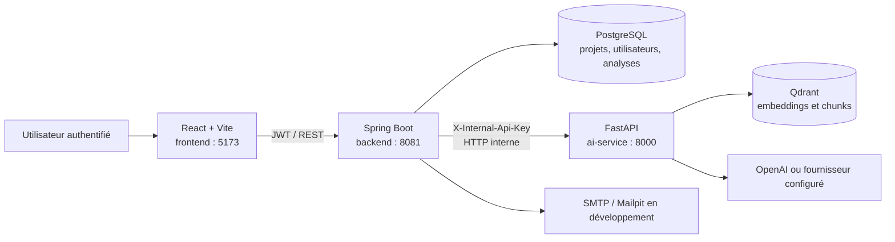
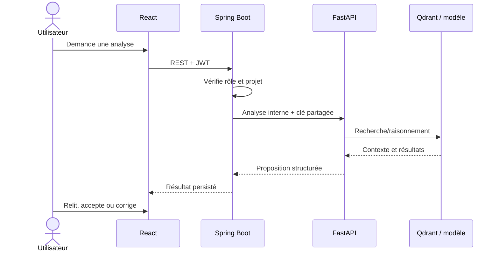
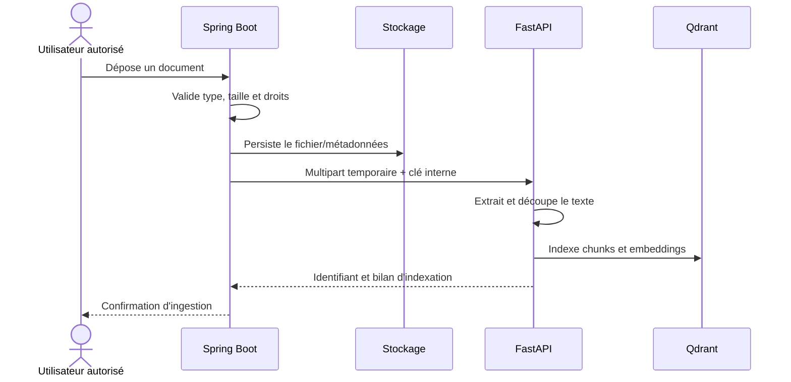
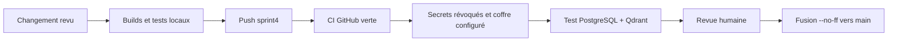

# Guide technique et d'exploitation

Ce document décrit le fonctionnement réel du monorepo **Engineering Copilot**, les prérequis de son exécution locale, ses contrats entre services et les critères de vérification. Il complète les documents historiques de Sprint 2 et Sprint 3 ; le statut de livraison est centralisé dans l'[audit de finalisation](FINALIZATION_AUDIT.md).

## 1. Objectif et périmètre

Engineering Copilot aide une équipe à centraliser les projets, dépôts, documents et analyses techniques. Une analyse générée par IA reste une **proposition** : elle doit être relue par un utilisateur autorisé avant de devenir une décision, une recommandation ou une tâche de suivi.

Le dépôt est volontairement organisé en quatre unités déployables :

| Unité | Répertoire | Rôle | Exposition |
| --- | --- | --- | --- |
| Client web | `frontend/` | Authentification, écrans de travail, tableaux de bord et visualisation des résultats | Navigateur, port 5173 en développement |
| API métier | `backend/` | API REST, règles métier, JWT/RBAC, persistance et passerelle vers l'IA | Seule API consommée par le navigateur, port 8081 |
| Service IA | `ai-service/` | Ingestion documentaire, RAG, agents d'analyse et recherche vectorielle | Interne au backend, port 8000 |
| Dépendances d'état | `infra/` | PostgreSQL, Qdrant et Mailpit pour le développement | Ports 5432, 6333 et 8025 |

## 2. Architecture



### Frontend

Le frontend est une SPA React/TypeScript construite avec Vite et stylée avec Tailwind. Il utilise Axios pour appeler uniquement le backend. Il ne détient ni clé OpenAI, ni clé interne IA, ni accès direct à Qdrant. Les pages assistant, projet, dépôt, document, analyse, revue et santé sont isolées par les rôles transmis dans le JWT.

### Backend

Le backend Spring Boot cible Java 17. Il porte les règles métier, la validation, la persistance JPA/PostgreSQL, la sécurité JWT et les autorisations par rôle. `AiRagClient` est la frontière technique vers FastAPI : il ajoute `X-Internal-Api-Key`, applique des délais et transforme les indisponibilités IA en erreurs métier explicites. Le backend ne transmet jamais le JWT utilisateur au service IA.

### Service IA

Le service FastAPI expose une liveness probe publique (`GET /health`) et des routes internes protégées sous `/api/v1`. Il extrait les textes, découpe les documents, crée ou interroge les embeddings, puis produit des réponses sourcées. Les routes RAG, d'ingestion et d'analyse refusent un appel sans `X-Internal-Api-Key` valide.

### Données et frontières de confiance

| Donnée | Autorité | Règle |
| --- | --- | --- |
| Utilisateurs, rôles, projets, analyses | PostgreSQL via Spring Boot | Le frontend ne parle pas à la base directement. |
| Fichiers déposés | Backend puis stockage configuré | Le backend transmet une copie temporaire au service IA, jamais un chemin local. |
| Chunks et vecteurs | Qdrant via FastAPI | Qdrant n'est pas exposé au navigateur. |
| Clés et mots de passe | `.env` local ou coffre de secrets | Aucun secret ne doit être commité. |

## 3. Flux fonctionnels essentiels

### Analyse de dépôt



### Ingestion d'un document



## 4. Pré-requis et configuration

### Versions attendues

| Outil | Version attendue | Contrôle |
| --- | --- | --- |
| Java | 17+ | `java -version` ; Maven compile avec Java 17 |
| Node.js | 22+ | `node --version` |
| Python | 3.12 | `python --version` |
| PostgreSQL | 16 recommandé | port 5432 accessible |
| Qdrant | Docker local ou Qdrant Cloud compatible | port 6333 local ou sonde RAG protégée disponible |
| Docker Desktop ou moteur Compose équivalent | requis pour `infra/` | `docker compose version` |

Créer les fichiers locaux à partir des exemples :

```powershell
Copy-Item backend/.env.example backend/.env
Copy-Item ai-service/.env.example ai-service/.env
Copy-Item frontend/.env.example frontend/.env
```

La valeur `AI_INTERNAL_API_KEY` doit être forte et identique dans `backend/.env` et `ai-service/.env`. Définir les variables OpenAI seulement si les scénarios appelant le fournisseur sont utilisés. Ne jamais copier une valeur réelle dans un README, un ticket ou un commit.

### Démarrage local reproductible

1. Démarrer PostgreSQL, Qdrant et Mailpit :

   ```powershell
   docker compose -f infra/docker-compose.yml up -d
   ```

2. Dans des terminaux séparés, démarrer dans cet ordre :

   ```powershell
   cd ai-service
   python -m pip install -r requirements.txt
   python -m uvicorn app.main:app --reload --port 8000
   ```

   ```powershell
   cd backend
   .\mvnw.cmd spring-boot:run
   ```

   ```powershell
   cd frontend
   npm ci
   npm run dev
   ```

3. Vérifier les services :

   ```powershell
   Invoke-WebRequest http://127.0.0.1:5173/
   Invoke-WebRequest http://127.0.0.1:8000/health
   Test-NetConnection 127.0.0.1 -Port 8081
   Test-NetConnection 127.0.0.1 -Port 5432
   ```

Si `QDRANT_URL` cible une instance locale, ajouter `Test-NetConnection 127.0.0.1 -Port 6333`. Si elle cible Qdrant Cloud, vérifier plutôt la route interne RAG avec la clé de service. `/api/health` côté backend est réservé aux utilisateurs authentifiés : une réponse `401` sans JWT est donc attendue. La liveness FastAPI confirme que le processus est actif ; la route interne RAG confirme en plus la présence de Qdrant et de la configuration de clé.

## 5. Tests et assurance qualité

| Couche | Commande | Ce que le contrôle prouve |
| --- | --- | --- |
| Frontend | `cd frontend; npm run build` | TypeScript se vérifie et Vite produit les assets. |
| IA déterministe | `cd ai-service; python -m pytest -q` | Les tests unitaires et de traitement local s'exécutent sans fournisseur externe. |
| Backend compilation | `cd backend; .\mvnw.cmd -DskipTests package` | Les dépendances et le code Java 17 compilent. |
| Backend complet | `cd backend; .\mvnw.cmd test` | Les tests unitaires, le contexte Spring et le smoke test PostgreSQL sont vérifiés. |
| Intégration RAG | `RUN_LIVE_INTEGRATION_TESTS=1 python -m pytest tests -m integration -q` | Nécessite Qdrant, clés et fournisseurs réellement disponibles. |

Les tests d'intégration IA sont exclus par défaut afin que la CI reste déterministe et ne dépende ni d'un réseau, ni de coûts fournisseur, ni de collections distantes. La CI GitHub exécute le build frontend, les tests IA par défaut et les tests backend avec un PostgreSQL éphémère sur `main`, `sprint4`, `Sprint2` et `Sprint3`. Dans ce job, `create-drop` est limité à la base temporaire de CI ; l'application normale conserve sa stratégie de schéma configurée.

## 6. Évaluation RAG et métriques

Les résultats reproductibles sont conservés dans `ai-service/experiments/results/` et expliqués dans [EXPERIMENTATIONS_ET_EVALUATIONS.md](../ai-service/docs/EXPERIMENTATIONS_ET_EVALUATIONS.md). Le jeu de synthèse `retrieval_evaluation_summary.json` contient 64 questions avec `top_k=10`.

| Embedding | Hit@file | Precision | Recall | MRR | Hit@category | Temps moyen |
| --- | ---: | ---: | ---: | ---: | ---: | ---: |
| OpenAI `text-embedding-3-small` | 0.8906 | 0.6703 | 0.8724 | 0.7942 | 0.9688 | 0.8125 s |
| MiniLM | 0.9062 | 0.6281 | 0.8880 | 0.7465 | 0.9531 | 4.9525 s |

Lecture : `Hit@file` mesure la présence du bon document dans les résultats, `Precision` la proportion de résultats pertinents, `Recall` la couverture, et `MRR` la position du premier résultat pertinent. Ces chiffres sont des résultats expérimentaux, pas des SLO de production. Ils doivent être recalculés à chaque évolution du corpus, du modèle d'embedding ou de la stratégie de découpage.

## 7. Incidents rencontrés et résolutions

| Symptôme | Cause identifiée | Résolution appliquée | Prévention |
| --- | --- | --- | --- |
| Import Maven de `spring-boot-starter-mail` en échec | Certificat TLS local Norton non approuvé par le JDK Corretto | Racine locale importée dans le magasin de confiance du JDK ; téléchargement Maven forcé | Utiliser un JDK d'équipe avec magasin de certificats administré. |
| IDE configuré avec Java 8 alors que Maven cible 17 | JDK de module IntelliJ incohérent | Module configuré sur Corretto 17 | Vérifier `Project SDK` et `JAVA_HOME` avant la compilation. |
| Tests IA bloqués par des variables d'environnement absentes | Tests de diagnostic et intégrations externes collectés par défaut | Configuration sûre par défaut, marqueur `integration`, collecte ciblée | Laisser les tests connectés explicites et documenter leurs dépendances. |
| CI IA instable | Fournisseurs, Qdrant ou secrets requis en collection | Tests externes exclus de la CI légère | Exécuter l'intégration dans un environnement éphémère avec secrets. |
| Sonde RAG initialement indisponible | Processus FastAPI lancé dans un bac à sable sans accès au Qdrant Cloud | Redémarrage du service dans un contexte réseau autorisé ; la collection a répondu avec 800 vecteurs | Tester la sonde RAG protégée lorsque Qdrant est externe. |

## 8. Limites connues et suivi de production

- Le bundle frontend principal dépasse actuellement le seuil d'avertissement Vite (environ 834 kB minifié). Fractionner les routes et les dépendances lourdes est une optimisation recommandée, non un échec de build.
- Le tableau de santé du frontend mélange aujourd'hui des télémétries de démonstration et des données d'API. Il ne doit pas être interprété comme un système de supervision/SLO de production. Ajouter Actuator, métriques réelles et alerting avant un déploiement critique.
- La CI fournit désormais un PostgreSQL temporaire pour les smoke tests backend. Il reste à introduire des migrations versionnées (par exemple Flyway) afin que le schéma de production ne dépende plus d'une initialisation manuelle.
- La santé RAG ne peut être déclarée prête que si Qdrant est joignable et que la route protégée répond correctement avec la clé interne configurée.

## 9. Procédure de livraison



Avant une fusion : vérifier les trois jobs CI, les dépendances d'infrastructure, les migrations, l'absence de secret suivi par Git et le statut de l'[audit de finalisation](FINALIZATION_AUDIT.md). La procédure Git exacte est documentée dans le README et l'audit.
